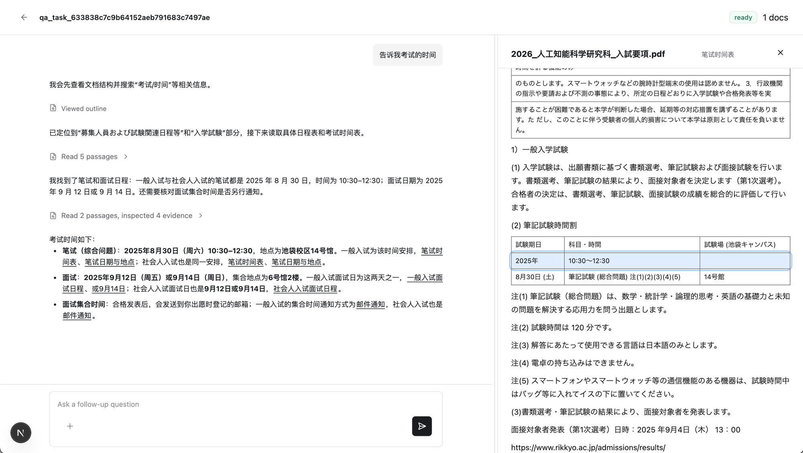
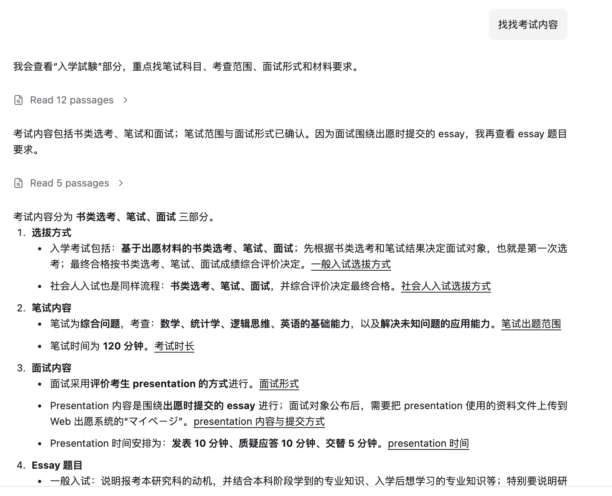

<p align="center">
  <h1 align="center">TraceAgent</h1>
  <p align="center">
    <strong>Evidence-grounded document QA — すべての回答を原文まで追跡できる。</strong>
  </p>
  <p align="center">
    <a href="README.md">中文</a> · <a href="#demo">Demo</a> · <a href="#quickstart">Quick Start</a> · <a href="LICENSE">MIT License</a>
  </p>
</p>

---

一般的な文書 QA は答えだけを返します。TraceAgent は答え + 証拠を返します。

モデルが文書の事実を回答するとき evidence link を付与し、クリックすると原文が開いて該当箇所がハイライトされます。モデルを信じる必要はありません——自分の目で原文を確認できます。

<h2 id="demo">🎬 デモ</h2>


<p align="center"><em>左：マルチターン QA（過程表示 + evidence link） · 右：原文ハイライト</em></p>

<table>
<tr>
<td width="50%">

<p align="center"><em>試験時間を確認</em></p>
</td>
<td width="50%">

<p align="center"><em>試験内容を検索</em></p>
</td>
</tr>
</table>

## ✨ 主な特徴

| | 機能 | 説明 |
|---|---|---|
| 💬 | **マルチターン文書 QA** | PDF / DOCX をアップロードして同じ文書群に継続して質問 |
| 🔗 | **Evidence Link** | 回答中の事実を `[label](evidence://...)` で原文に紐づけ |
| 📖 | **原文 Review** | evidence クリックで右側に原文 HTML を表示、段落 / リスト項目 / 表行をハイライト |
| 🧭 | **過程表示** | モデルが目次を見て、検索し、片段を読む過程を可視化 |
| 🛑 | **生成キャンセル** | いつでも回答生成を中断、入力欄は編集可能なまま |
| 📄 | **複数形式** | PDF（MinerU OCR）と DOCX（python-docx）に対応 |

## 🧠 仕組み


TraceAgent は文書全体を prompt に詰め込まず、文書を読み取り専用の仮想リポジトリとして扱います。モデルは `tree` / `grep` / `read` / `inspect` の 4 つのツールで必要に応じて資料をたどり、人が資料を調べるように段階的に答えを見つけます。

> 詳細なアーキテクチャは [`agent/docs/DESIGN.md`](agent/docs/DESIGN.md) を参照

<h2 id="quickstart">⚡ Quick Start</h2>

```bash
# 環境
conda create -n agent-gate python=3.11 -y && conda activate agent-gate
```

依存関係をインストールし、frontend をビルド：

```bash
./scripts/install.sh
```

リポジトリルートに `.env` を作成します。起動スクリプトが自動的に読み込みます。

```bash
BASE_URL="https://your-model-endpoint/v1"
OPENAI_API_KEY="your-api-key"
MODEL="your-model-name"
MODEL_API_TRANSPORT="responses"

DOCUMENT_PROCESSOR_MINERU_LANG="japan"

AGENT_PORT=8001
BACKEND_PORT=8000
FRONTEND_PORT=3000
```

本番起動：

```bash
./scripts/start.sh
```

`install.sh` は Python / frontend 依存関係をインストールして `frontend` を本番ビルドするだけで、`.env` は読み込みません。`start.sh` は `.env` を読み込んで `agent`、`backend`、`frontend` を起動するだけで、`--reload` は使いません。

ブラウザで http://127.0.0.1:3000 を開けば使えます。

> 詳細な設定とトラブルシューティングは各パッケージの README を参照：[`agent/`](agent/README.md) · [`backend/`](backend/README.md) · [`frontend/`](frontend/docs/)

## 🗺️ プロジェクト構成

```
agent/        AI 層：文書標準化 + QA Agent
backend/      永続化と編成：tasks / documents / messages / events
frontend/     ブラウザ工作台：アップロード、QA、過程表示、evidence review
```

## 📄 ライセンス

[MIT](LICENSE)
