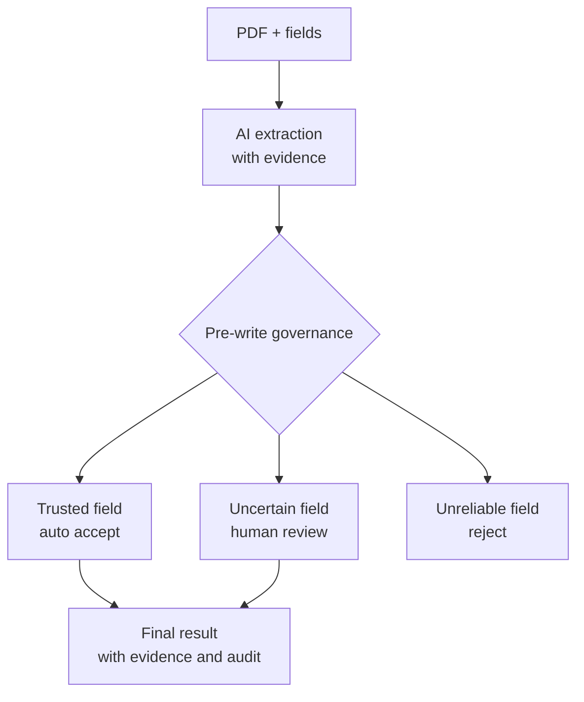

# TraceAgent

> 🔎 信頼できる AI 文書抽出のための、フィールド単位の trace / review ワークベンチ。

[中文](README.md) · `field trace` · `replay` · `human-in-the-loop`

TraceAgent は、AI による文書抽出をブラックボックスな JSON 出力で終わらせず、各フィールドごとに根拠・処理過程・判断・監査記録を追跡できるワークフローとして扱います。

単にモデルに「フィールドを埋めさせる」のではなく、モデルがどこを読んだのか、なぜその値を書いたのか、根拠が十分か、そのフィールドを最終結果に入れてよいかを確認します。

```text
black-box JSON  ->  フィールド単位の根拠  ->  再生可能な処理過程  ->  route decision  ->  監査可能な結果
```

| 追跡 | 再生 | 判断 | 確認 | 技術構成 |
| --- | --- | --- | --- | --- |
| フィールド単位の根拠 | tool-call timeline | accept / review / reject | human-in-the-loop | FastAPI · React · SQLite |

## 🎬 デモ

https://github.com/user-attachments/assets/54dc78da-bd68-4edf-8500-9dbf55f8239d

## ✨ なぜ TraceAgent なのか

一般的な文書抽出システムは、最終的な JSON だけを表示しがちです。その場合、フィールド値が正しいのか、根拠がどこにあるのか、なぜモデルがその値を選んだのか、どのフィールドを人間が確認すべきかが見えにくくなります。

TraceAgent の考え方は、AI の抽出結果をそのまま業務システムに入れないことです。各フィールドを、追跡・確認・統制できる単位として扱います。

```text
PDF + task_spec
  -> フィールド単位の AI 抽出
  -> 各フィールドに根拠・処理過程・リスク判断を紐づける
  -> route policy が accept / review / reject を判断
  -> 信頼できるフィールドは自動通過、不確実なフィールドは人間が確認
  -> 最終結果には根拠と監査記録を残す
```

TraceAgent が重視するのは「モデルが何を答えたか」だけではなく、「その答えをなぜ信頼できるのか」です。

## 🚀 主な特徴

- 🔎 フィールド単位の trace: 各フィールドを原文 evidence、tool action、書き込み理由まで追跡できます。
- 🎬 抽出過程の replay: UI で `plan -> read -> table query -> set_field -> finish` の流れを再生できます。
- 🛡️ 最終結果に入れる前の判断: AI 出力は最終結果になる前に `accept / review / reject` の route を通ります。
- 🧑‍⚖️ 必要な箇所だけ human-in-the-loop: 信頼できるフィールドは自動通過し、不確実なフィールドだけを人間が確認します。
- 🧾 監査可能な出力: 最終結果には evidence、route decision、review record が残ります。

## 🧠 基本的な考え方

TraceAgent は単なる自動入力ツールではありません。AI 文書抽出のための、フィールド単位の governance layer です。

ユーザーが抽出したいフィールドを定義すると、TraceAgent は各フィールドを追跡可能な単位として扱います。

- 値: AI が最終的に書いた内容。
- 根拠: その値が文書のどこに由来するか。
- 処理過程: AI がどのように計画し、読み、表を検索し、フィールドを書いたか。
- route decision: そのフィールドを accept / review / reject のどれにするか。
- 監査記録: 誰が、どの根拠で確認したか。

フィールドは、自動的に accept されるか、人間の review を通った後にだけ最終結果へ入ります。



## 🧰 細粒度の Trace Tools

TraceAgent の replay は後から作ったログではありません。抽出 agent の tool action そのものから構成されます。

```text
PDF
  -> document_processor が安定した id を持つ HTML / blocks を生成
  -> file_extraction_agent が trace 可能な tool でフィールドを抽出
  -> backend が actions、evidence_ids、field_states、route decisions を保存
  -> frontend が actions を replay
```

| Tool | 粒度 | ユーザーが追跡できる内容 |
| --- | --- | --- |
| `return_broad_plan` | タスク単位の計画 | broad 段階の抽出計画、リスク、読む順序。 |
| `update_plan` | 計画ステップ | どの計画ステップが実行中または完了したか、その理由。 |
| `read_element` | 単一 HTML 要素 | モデルが読んだ見出し、段落、リスト項目、表の概要。 |
| `read_section` | 章単位の再帰読み取り | 見出しから読まれた章範囲と evidence ids。 |
| `table_extraction` | 表クエリ | table id、SQL、該当行 evidence、`table_audit`、`query_audit`。 |
| `paragraph_extraction` | テキスト一致 | element id、pattern、matched text、span、evidence ids。 |
| `set_field` | フィールド書き込み | field value、evidence ids、書き込み理由、status、failure reason。 |
| `finish` | 実行結果の検証 | 抽出が完了したか、欠落フィールドや evidence エラーがあるか。 |

## ⚡ ローカルでの実行

TraceAgent は 3 つのローカルサービスで構成されます。

- `agent`: PDF 標準化、フィールド抽出、route policy 評価。
- `backend`: タスク状態、結果保存、review、audit、SQLite。
- `frontend`: アップロード、replay、field review、結果確認。

```bash
conda create -n agent-gate python=3.11 -y
conda activate agent-gate
cd /path/to/agent_gate
pip install -e "agent[dev]"
pip install -e "backend[dev]"
pnpm --dir frontend install
```

PDF とモデルを実行する場合は、`agent` を起動するターミナルで次の環境変数を設定します。

```bash
export BASE_URL="https://your-model-endpoint/v1"
export OPENAI_API_KEY="your-api-key"
export BROAD_MODEL="your-broad-model-name"
export RESOLUTION_MODEL="your-resolution-model-name"
export ROUTE_POLICY_MODEL="your-route-policy-model-name"
export MINERU_BIN="mineru"
export DOCUMENT_PROCESSOR_MINERU_LANG="japan"
```

`agent`:

```bash
conda activate agent-gate
cd /path/to/agent_gate
python -m uvicorn --app-dir agent main:app --reload --host 127.0.0.1 --port 8001
```

`backend`:

```bash
conda activate agent-gate
cd /path/to/agent_gate
AGENT_SERVICE_BASE_URL=http://127.0.0.1:8001 \
AGENT_SERVICE_TIMEOUT_SECONDS=1200 \
uvicorn backend.main:app --reload --host 127.0.0.1 --port 8000
```

`frontend`:

```bash
cd /path/to/agent_gate
BACKEND_BASE_URL=http://127.0.0.1:8000 \
pnpm --dir frontend dev --port 3000
```

ブラウザで開きます。

```text
http://127.0.0.1:3000/
```

## 🗺️ ディレクトリ構成

```text
frontend/  ユーザー画面：upload、replay、field review、audit view
backend/   管理サービス：task state、result、review、audit、SQLite
agent/     AI レイヤー：PDF standardization、field extraction、route policy
```

## 📄 ライセンス

このプロジェクトは [MIT License](LICENSE) のもとで公開されています。
