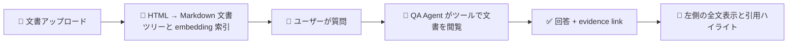

<p align="center">
  <h1 align="center">TraceAgent</h1>
  <p align="center">
    <strong>Evidence-grounded document QA - すべての回答を原文まで追跡できる。</strong>
  </p>
  <p align="center">
    <a href="README.md">中文</a> · <a href="#demo">Demo</a> · <a href="#quickstart">Quick Start</a> · <a href="LICENSE">MIT License</a>
  </p>
</p>

---

一般的な文書 QA は答えだけを返します。TraceAgent は答え + 証拠を返します。

モデルが文書の事実を回答するとき evidence link を付与し、クリックすると原文が開いて該当箇所がハイライトされます。自分の目で原文を確認できます。ブラウザのワークスペースには Agent Gate と表示されます。

<h2 id="demo">🎬 デモ</h2>


<p align="center"><em>左：全文表示と引用ハイライト · 右：ツールの過程、回答と数字の引用</em></p>

スクリーンショットは実際のローカル画面と既存の Orion サンプル会話です（2026-10-02 更新）。

<table>
<tr>
<td width="50%">

<p align="center"><em>ホーム：文書追加と質問入力</em></p>
</td>
<td width="50%">

<p align="center"><em>会話：文書管理と引用付き回答</em></p>
</td>
</tr>
</table>

## ✨ 主な特徴

| | 機能 | 説明 |
|---|---|---|
| 💬 | **マルチターン文書 QA** | PDF / DOCX をアップロードして同じ文書群に継続して質問 |
| 🔗 | **Evidence Link** | Markdown ブロックへのリンクをクリック可能な数字の引用として表示 |
| 📖 | **原文 Review** | 引用クリックで左側に全文を表示し、対象の Markdown ブロックをハイライト |
| | **文書管理** | ファイルごとの処理状態、再試行、追加、ダウンロードと削除 |
| | **会話の復元** | backend のデータベースから最近の会話と履歴を取得 |
| 🧭 | **過程表示** | モデルが目次を見て、検索し、片段を読む過程を可視化 |
| 🛑 | **生成キャンセル** | いつでも回答生成を中断、入力欄は編集可能なまま |
| 📄 | **複数形式** | PDF（MinerU OCR）と DOCX（python-docx）に対応 |

## 🧠 仕組み


```mermaid
flowchart LR
    Upload["📄 文書アップロード"] --> Normalize["🔧 HTML → Markdown 文書ツリーと embedding 索引"]
    Normalize --> Ask["💬 ユーザーが質問"]
    Ask --> Agent["🤖 QA Agent がツールで文書を閲覧"]
    Agent --> Answer["✅ 回答 + evidence link"]
    Answer --> Review["📖 左側の全文表示と引用ハイライト"]
```

TraceAgent は文書全体を prompt に詰め込まず、文書を読み取り専用の仮想リポジトリとして扱います。モデルは `ls` / `grep` / `read` / `search_embedding` の 4 つのツールで必要に応じて資料をたどり、人が資料を調べるように段階的に答えを見つけます。

> 詳細なアーキテクチャは [`agent/docs/DESIGN.md`](agent/docs/DESIGN.md) を参照

<h2 id="quickstart">⚡ Quick Start</h2>

```bash
# 環境
conda create -n agent-gate python=3.11 -y && conda activate agent-gate
```

依存関係をインストールし、frontend をビルド：

```bash
./scripts/install.sh
```

document service は起動時に embedding モデルを読み込み、ウォームアップ後に待ち受けを開始します。初回は Hugging Face からのモデルダウンロードが必要です。

リポジトリルートに `.env` を作成します。起動スクリプトが自動的に読み込みます。

```bash
BASE_URL="https://your-model-endpoint/v1"
OPENAI_API_KEY="your-api-key"
MODEL="your-model-name"
MODEL_API_TRANSPORT="responses"

DOCUMENT_PROCESSOR_MINERU_LANG="japan"

AGENT_PORT=8001
DOCUMENT_PORT=8002
BACKEND_PORT=8000
FRONTEND_PORT=3000
STORAGE_PORT=9000
```

本番起動：

```bash
./scripts/start.sh
```

ブラウザで http://127.0.0.1:3000 を開けば使えます。

1. Add source / Add sources で PDF または DOCX を選ぶと、ファイルを順番に処理します。1 回の選択は最大 20 ファイル、合計 32 MiB。空ファイルには対応しません。
2. 処理完了後は `/tasks/{session_id}` に移動します。質問を入力して送信してください。要約や詳細のボタンは編集可能な質問を入力するだけです。
3. 回答の数字の引用をクリックすると左側に全文とハイライトを表示します。閉じると Sources に戻り、Add files で文書を追加できます。
4. 左上のメニューの Recent workspaces、または会話 URL から文書と履歴を復元できます。

既定のデータベースは `backend/backend.sqlite3`、ローカル storage は `storage/data` です。`BACKEND_DATABASE_PATH` と `STORAGE_DATA_ROOT` で変更できます。`S3_ENDPOINT_URL` を設定すると外部 S3 互換サービスを利用し、ローカル storage の起動を省略します。終了時はスクリプトが起動したサービスを停止します。

現在は単一ユーザー向けのローカル構成です。backend は単一プロセスで動作し、テナント認証や旧 `qa_*` データの自動移行はありません。

> 詳細な設定とトラブルシューティングは各パッケージの README を参照：[`agent/`](agent/README.md) · [`backend/`](backend/README.md) · [`frontend/`](frontend/docs/)

## 🗺️ プロジェクト構成

```
agent_proto/      共有 protobuf/gRPC 契約
document_service/ 文書解析、Markdown 文書ツリー、embedding とリソース公開
storage/          ローカル S3 互換 HTTP サービス
shared/           object store クライアント
agent/            QA Agent（LangGraph）
backend/          SQLite：sessions / resources / turns / messages
frontend/         文書管理、QA、ツールの過程と全文表示（Next.js）
```

## 📄 ライセンス

[MIT](LICENSE)
