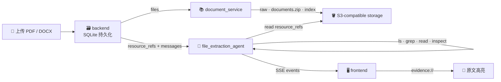

<p align="center">
  <h1 align="center">TraceAgent</h1>
  <p align="center">
    <strong>Evidence-grounded Document QA — 让每个回答都能追溯到原文</strong>
  </p>
  <p align="center">
    <code>FastAPI</code> · <code>LangGraph</code> · <code>Next.js</code> · <code>SSE</code>
  </p>
  <p align="center">
    <a href="README.ja.md">日本語</a> · <a href="#demo">Demo</a> · <a href="#quickstart">Quick Start</a> · <a href="LICENSE">MIT License</a>
  </p>
</p>

---

> 普通文档 QA 只给答案；**TraceAgent 给答案 + 证据 + 可回放的推理过程。**

模型回答文档事实时附带 evidence link，点击即跳转原文高亮。你不需要相信模型——你可以自己核对它看了什么、读了哪里、结论由哪一句支撑。

<h2 id="demo">🎬 Demo</h2>

<p align="center">
  
</p>
<p align="center"><em>左：多轮 QA 对话（过程流 + evidence link） · 右：原文高亮定位</em></p>

<table>
<tr>
<td width="50%">

<p align="center"><em>查询考试时间</em></p>
</td>
<td width="50%">

<p align="center"><em>查找考试内容</em></p>
</td>
</tr>
</table>

## ✨ 核心亮点

| &nbsp; | 功能 | 说明 |
|:---:|---|---|
| 💬 | **多轮文档 QA** | 上传 PDF / DOCX，围绕同一批文档连续追问 |
| 🔗 | **Evidence Link** | 回答中的事实用 `[label](evidence://...)` 绑定原文位置 |
| 📖 | **原文 Review** | 点击 evidence 打开右侧原文，高亮段落 / 句子 / 列表项 / 表格行 |
| 🧭 | **过程可见** | 展示模型浏览目录、搜索关键词、阅读片段的完整轨迹 |
| 🛑 | **可取消生成** | 随时取消当前回答，后端立即终止 agent 循环 |
| 📄 | **多格式** | PDF（MinerU OCR）· DOCX（python-docx）→ 统一语义 HTML |

## 🧠 工作原理



TraceAgent 不把整篇文档塞进 prompt，而是将文档映射为**只读虚拟仓库**。模型通过 `ls` / `grep` / `read` / `inspect` 四个工具按需浏览，像人翻阅资料一样逐步定位答案，每一步都通过 SSE 实时推送到前端。

> 详细架构设计见 [`agent/docs/DESIGN.md`](agent/docs/DESIGN.md)

<h2 id="quickstart">⚡ Quick Start</h2>

**1. 创建环境**

```bash
conda create -n agent-gate python=3.11 -y && conda activate agent-gate
```

**2. 安装依赖**

```bash
./scripts/install.sh          # 安装 Python 包 + 构建前端
```

安装包含 storage 服务及默认 OpenVINO embedding 依赖。首次上传文档时会下载 embedding 模型，需要能访问 Hugging Face。

若公开模型下载返回 401，而匿名访问正常，可在 `.env` 设置 `HF_HUB_DISABLE_IMPLICIT_TOKEN=1`，避免自动发送本机已有的 Hugging Face token；需要访问私有模型时应使用有效凭据。

**3. 配置环境变量**

在仓库根目录创建 `.env`，启动脚本会自动读取：

```bash
BASE_URL="https://your-model-endpoint/v1"
OPENAI_API_KEY="your-api-key"
MODEL="your-model-name"
MODEL_API_TRANSPORT="responses"

DOCUMENT_PROCESSOR_MINERU_LANG="japan"

AGENT_PORT=8001
DOCUMENT_PORT=8002
BACKEND_PORT=8000
FRONTEND_PORT=3000
STORAGE_PORT=9000
```

**4. 启动服务**

```bash
./scripts/start.sh            # 启动 storage / agent / document service / backend / frontend
```

默认先启动本地 storage，数据保存在 `storage/data`，可用 `STORAGE_DATA_ROOT` 改目录。若使用已有 S3 兼容服务，在 `.env` 配置 `S3_ENDPOINT_URL`，脚本会复用该地址并跳过本地 storage。退出脚本时会停止本次启动的服务。

打开 http://127.0.0.1:3000 即可使用。

> 详细配置和故障排查见各子包 README：[`agent/`](agent/README.md) · [`backend/`](backend/README.md) · [`frontend/`](frontend/docs/)

## 🗺️ 项目结构

```
document_service/ 文档服务 — PDF/DOCX 解析、文档树、embedding 和资源发布
shared/       共享基础设施 — storage object store 客户端
agent/        AI 能力层 — QA Agent（LangGraph 驱动）
backend/      持久化与编排 — sessions / resources / messages / events（SQLite）
frontend/     浏览器工作台 — 上传、QA stream、过程流、evidence review（Next.js）
```

## 📄 License

[MIT](LICENSE)
