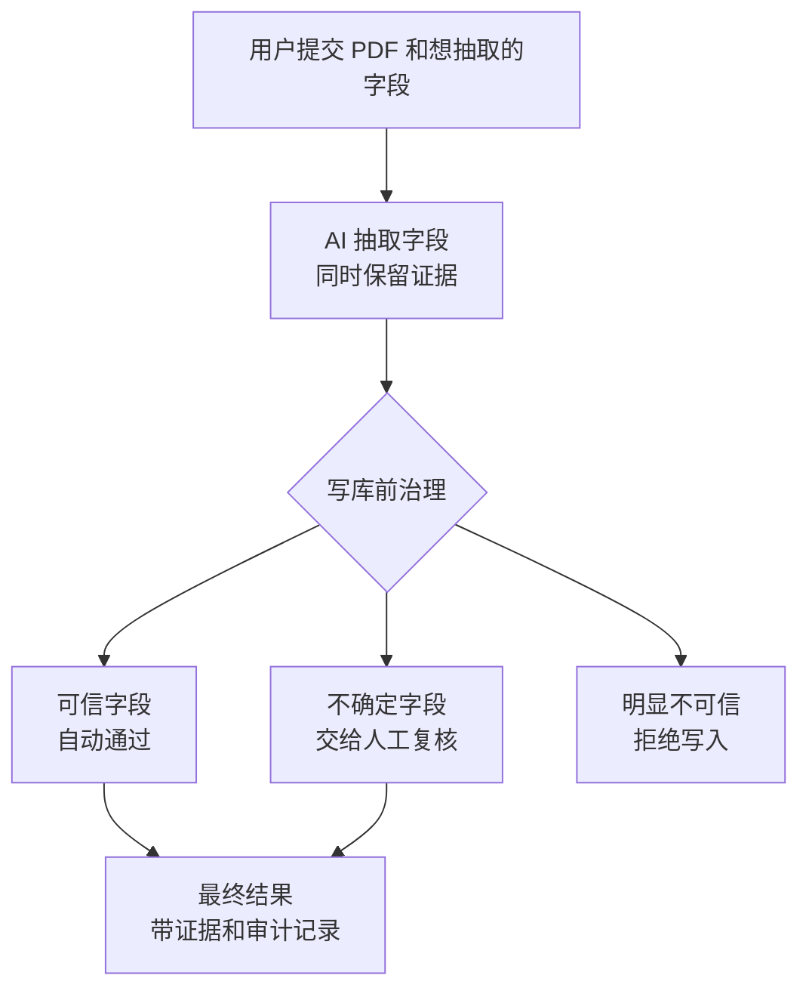

# TraceAgent

## Overview

TraceAgent 是一个面向文档字段抽取的可信 AI 工作台。它关注的不是“让模型给出一个答案”，而是让每一个字段答案都能被追踪、复核和治理。

传统文档抽取系统通常只展示最终 JSON：字段值对不对、证据在哪里、模型为什么这么填、哪些字段需要人工介入，都容易变成黑盒。TraceAgent 的方向是把 AI 抽取过程拆到字段级：每个字段都对应原文证据、抽取过程、风险判断和最终处置。

核心目标是：

- 让 AI 抽取结果不再是一次性黑盒输出。
- 让每个字段都能回到原文证据和抽取过程。
- 让可信字段自动通过，不确定字段进入人工复核。
- 让最终结果带着证据、route 决策和审计记录进入后续业务系统。

## Core Idea

TraceAgent 的核心不是“自动填表”，而是“字段级可追踪的 AI 抽取治理”。

用户定义要抽取的字段后，TraceAgent 会把每个字段都变成一个可治理对象：

- 字段值：AI 最终填了什么。
- 原文证据：这个字段来自文档哪里。
- 抽取过程：AI 查找、读取、查询表格和写入字段的过程。
- route 判断：这个字段是可以自动通过、需要人工复核，还是应该拒绝写入。
- 审计记录：最终是谁确认了这个字段，以及依据是什么。

字段只有在自动判断可信，或人工复核确认后，才会进入最终结果。



## What Makes It Different

- 字段级追踪：不是只看整份文档的处理日志，而是能追到每个字段的证据和过程。
- 写库前治理：AI 输出不会直接进入最终结果，必须经过字段级 route。
- 人工只处理不确定项：可信字段自动通过，复核精力集中在有疑点的字段。
- 前端可解释：用户在界面里能看到字段、证据、过程、复核入口和最终审计。
- 面向真实文档：当前主链路面向 PDF，支持多文档上传、表格证据、长字段值和字段级 replay。

## Current Scope

TraceAgent 当前是一个毕业设计 MVP，已经覆盖：

- 上传一个或多个 PDF，并显式提交 `task_spec`。
- 将 PDF 标准化为可抽取、可展示、可定位的文档结构。
- 按字段进行 AI 抽取，并保留工具调用和证据 trace。
- 对字段结果进行 `accept / review / reject` 路由。
- 在前端展示 replay、字段证据、复核入口和审计记录。
- 对需要人工介入的字段提交修正并生成最终结果。

## Local Demo

TraceAgent 由三个本地服务组成：

- `agent`：负责 PDF 标准化、字段抽取和字段级 route 判断。
- `backend`：负责任务状态、结果保存、人工复核和审计记录。
- `frontend`：负责上传、replay 展示、字段复核和结果查看。

### 1. 准备环境

以下命令默认从仓库根目录执行。新开终端时，先把 `/path/to/agent_gate` 替换为本机仓库路径并进入仓库根目录。

建议先在本地创建一个名为 `agent-gate` 的 Conda 环境，并在后续开发或运行时始终使用它：

```bash
conda create -n agent-gate python=3.11 -y
conda activate agent-gate
```

安装 Python 依赖：

```bash
cd /path/to/agent_gate
pip install -e "agent[dev]"
pip install -e "backend[dev]"
```

安装前端依赖：

```bash
cd /path/to/agent_gate
pnpm --dir frontend install
```

### 2. 配置最小运行变量

真实跑 PDF 和模型时，先在启动 `agent` 的终端里设置：

```bash
export BASE_URL="https://your-model-endpoint/v1"
export OPENAI_API_KEY="your-api-key"
export BROAD_MODEL="your-broad-model-name"
export RESOLUTION_MODEL="your-resolution-model-name"
export ROUTE_POLICY_MODEL="your-route-policy-model-name"
export MINERU_BIN="mineru"
export DOCUMENT_PROCESSOR_MINERU_LANG="japan"
```

中文 PDF 可以把 `DOCUMENT_PROCESSOR_MINERU_LANG` 改成 `ch`。更完整的配置说明放在 `agent/README.md`、`backend/README.md` 和 `frontend/docs/DESIGN.md`。

### 3. 启动服务

启动 `agent`：

```bash
conda activate agent-gate
cd /path/to/agent_gate
python -m uvicorn --app-dir agent main:app --reload --host 127.0.0.1 --port 8001
```

启动 `backend`：

```bash
conda activate agent-gate
cd /path/to/agent_gate
AGENT_SERVICE_BASE_URL=http://127.0.0.1:8001 \
AGENT_SERVICE_TIMEOUT_SECONDS=1200 \
uvicorn backend.main:app --reload --host 127.0.0.1 --port 8000
```

启动 `frontend`：

```bash
cd /path/to/agent_gate
BACKEND_BASE_URL=http://127.0.0.1:8000 \
pnpm --dir frontend dev --port 3000
```

打开：

```text
http://127.0.0.1:3000/
```

如果 `3000` 被占用，可以改用：

```bash
BACKEND_BASE_URL=http://127.0.0.1:8000 \
pnpm --dir frontend dev -- --port 3002
```

然后打开 `http://127.0.0.1:3002/`。

### 4. 常见启动问题

- backend 跑真实 PDF 时中途超时：先把 `AGENT_SERVICE_TIMEOUT_SECONDS` 调大，例如 `1800` 或 `2400`。
- backend 连不上 agent service：检查 `AGENT_SERVICE_BASE_URL` 是否指向 `agent service` 的监听地址，例如 `http://127.0.0.1:8001`。
- agent service 调不了模型：检查 `BASE_URL`、`OPENAI_API_KEY` 和对应模型名是否设置在启动 `agent service` 的终端里。
- frontend 页面提示 backend unavailable：检查启动 frontend 时的 `BACKEND_BASE_URL` 是否指向 backend，例如 `http://127.0.0.1:8000`。

## Repository Map

```text
frontend/  用户工作台：上传、replay、字段复核和审计查看
backend/   任务治理：状态、结果、review、audit 和 SQLite
agent/     AI 能力：PDF 标准化、字段抽取和 route policy
```

更细的接口、模块边界和测试策略放在各目录自己的 `README.md`、`docs/API.md` 和 `docs/DESIGN.md` 中。根 README 只保留项目方向和本地运行入口。

## Next Directions

后续可以继续沿着“字段级可信抽取”方向扩展：

- 流式返回结果：让 backend / agent service 把文档处理、字段抽取、route policy 和 replay action 增量推给前端，减少长任务等待感。
- 前端接入 LLM 辅助写字段：在创建任务或人工复核时，由前端调用 LLM 根据用户描述生成字段定义、补全字段配置或给出字段值草稿，最终仍由用户确认后提交。
