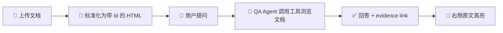

<p align="center">
  <h1 align="center">TraceAgent</h1>
  <p align="center">
    <strong>Evidence-grounded document QA — 让每个回答都能追溯到原文。</strong>
  </p>
  <p align="center">
    <a href="README.ja.md">日本語</a> · <a href="#demo">Demo</a> · <a href="#quickstart">Quick Start</a> · <a href="LICENSE">MIT License</a>
  </p>
</p>

---

普通文档 QA 只给答案，TraceAgent 给答案 + 证据。

模型回答文档事实时附带 evidence link，点击即可跳转原文高亮——你不需要相信模型，你可以自己核对。

<h2 id="demo">🎬 Demo</h2>


<p align="center"><em>左：多轮 QA 对话（过程流 + evidence link） · 右：原文高亮定位</em></p>

<table>
<tr>
<td width="50%">

<p align="center"><em>查询考试时间</em></p>
</td>
<td width="50%">

<p align="center"><em>查找考试内容</em></p>
</td>
</tr>
</table>

## ✨ 核心亮点

| | 功能 | 说明 |
|---|---|---|
| 💬 | **多轮文档 QA** | 上传 PDF / DOCX，围绕同一批文档连续追问 |
| 🔗 | **Evidence Link** | 回答中的事实用 `[label](evidence://...)` 绑定原文位置 |
| 📖 | **原文 Review** | 点击 evidence 打开右侧原文 HTML，高亮段落 / 列表项 / 表格行 |
| 🧭 | **过程可见** | 展示模型浏览目录、搜索、阅读片段的完整过程 |
| 🛑 | **可取消生成** | 随时取消当前回答，输入框保持可编辑 |
| 📄 | **多格式** | PDF（MinerU OCR）和 DOCX（python-docx） |

## 🧠 工作原理



TraceAgent 不把整篇文档塞进 prompt，而是把文档映射为只读虚拟仓库。模型通过 `tree` / `grep` / `read` / `inspect` 四个工具按需浏览，像人翻阅资料一样逐步定位答案。

> 详细架构设计见 [`agent/docs/DESIGN.md`](agent/docs/DESIGN.md)

<h2 id="quickstart">⚡ Quick Start</h2>

```bash
# 环境
conda create -n agent-gate python=3.11 -y && conda activate agent-gate
```

安装依赖并构建前端：

```bash
./scripts/install.sh
```

在仓库根目录创建 `.env`，启动脚本会自动读取它：

```bash
BASE_URL="https://your-model-endpoint/v1"
OPENAI_API_KEY="your-api-key"
MODEL="your-model-name"
MODEL_API_TRANSPORT="responses"

DOCUMENT_PROCESSOR_MINERU_LANG="japan"

AGENT_PORT=8001
BACKEND_PORT=8000
FRONTEND_PORT=3000
```

生产启动：

```bash
./scripts/start.sh
```

打开 http://127.0.0.1:3000 即可使用。

> 详细配置和故障排查见各子包 README：[`agent/`](agent/README.md) · [`backend/`](backend/README.md) · [`frontend/`](frontend/docs/)

## 🗺️ 项目结构

```
agent/        AI 能力层：文档标准化 + QA Agent
backend/      持久化与编排：tasks / documents / messages / events
frontend/     浏览器工作台：上传、QA、过程流、evidence review
```

## 📄 License

[MIT](LICENSE)
