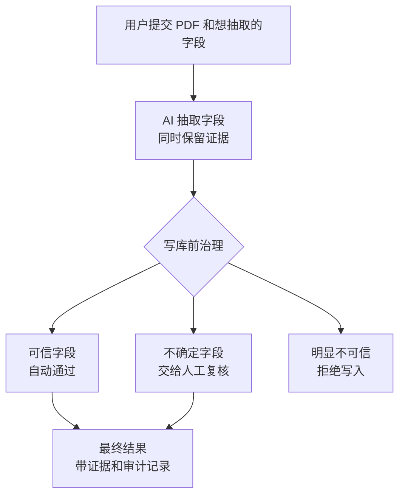

# TraceAgent

> 🔎 面向可信 AI 文档抽取的字段级 trace 与 review 工作台。

[日本語版](README.ja.md) · `field trace` · `replay` · `human review`

TraceAgent 把 AI 文档抽取从一次性黑盒 JSON，变成字段级可追踪、可回放、可治理、可审计的工作流。

它不是只让模型“填几个字段”，而是追踪模型看了哪里、为什么写入、证据是否足够，以及这个字段能不能进入最终结果。

```text
black-box JSON  ->  字段证据  ->  可回放动作  ->  route 决策  ->  可审计结果
```

| Trace | Replay | Govern | Review | Stack |
| --- | --- | --- | --- | --- |
| 字段级证据 | 工具调用时间线 | accept / review / reject | 人工复核 | FastAPI · React · SQLite |

## 🎬 演示

https://github.com/user-attachments/assets/54dc78da-bd68-4edf-8500-9dbf55f8239d

## ✨ 为什么做 TraceAgent

传统文档抽取系统通常只展示最终 JSON。字段值对不对、证据在哪里、模型为什么这么填、哪些字段需要人工介入，都容易变成黑盒。

TraceAgent 的核心判断是：AI 抽取结果不应该直接写入业务系统。每个字段都应该先成为一个可追踪、可复核、可治理的对象。

```text
PDF + task_spec
  -> AI 按字段抽取
  -> 每个字段绑定证据、过程和风险判断
  -> route policy 决定 accept / review / reject
  -> 可信字段自动通过，不确定字段进入人工复核
  -> 最终结果带着证据和审计记录进入后续系统
```

TraceAgent 关注的不是“模型答了什么”，而是“这个答案凭什么可以被相信”。

## 🚀 核心亮点

- 🔎 字段级追踪：每个字段都能回到原文 evidence、工具动作和写入理由。
- 🎬 可回放抽取：前端可以按 `plan -> read -> table query -> set_field -> finish` 回放抽取过程。
- 🛡️ 写库前治理：AI 输出必须先经过字段级 `accept / review / reject`，不会直接进入最终结果。
- 🧑‍⚖️ 人工只处理不确定项：可信字段自动通过，复核精力集中在有疑点的字段。
- 🧾 可审计结果：最终结果保留 evidence、route 决策和人工复核记录。

## 🧠 核心思路

TraceAgent 的核心不是“自动填表”，而是“字段级可追踪的 AI 抽取治理”。

用户定义要抽取的字段后，TraceAgent 会把每个字段都变成一个可治理对象：

- 字段值：AI 最终填了什么。
- 原文证据：这个字段来自文档哪里。
- 抽取过程：AI 查找、读取、查询表格和写入字段的过程。
- route 判断：这个字段是可以自动通过、需要人工复核，还是应该拒绝写入。
- 审计记录：最终是谁确认了这个字段，以及依据是什么。

字段只有在自动判断可信，或人工复核确认后，才会进入最终结果。



## 🧰 细粒度 Trace 工具

TraceAgent 的字段级 replay 不是事后编出来的日志，而是抽取 agent 每一步工具调用留下的 `actions`。

```text
PDF
  -> document_processor 生成带稳定 id 的 HTML / blocks
  -> file_extraction_agent 用可追踪工具逐步抽取字段
  -> backend 保存 actions、evidence_ids、field_states 和 route 决策
  -> frontend replay 按工具动作回放
```

| Tool | 追踪粒度 | 用户能追踪到什么 |
| --- | --- | --- |
| `return_broad_plan` | 任务级计划 | broad 阶段给出的抽取计划、风险和后续阅读顺序。 |
| `update_plan` | 计划步骤级 | resolution 执行到哪一步计划，什么时候开始、什么时候完成，以及推进原因。 |
| `read_element` | 单个 HTML 元素级 | 模型读取的标题、段落、列表项或表格结构摘要。 |
| `read_section` | 文件树递归章节级 | 从标题出发读取到的章节范围和证据 ids。 |
| `table_extraction` | 表格查询级 | 表格 id、SQL、命中行证据、`table_audit` 和 `query_audit`。 |
| `paragraph_extraction` | 文本匹配级 | 元素 id、pattern、匹配文本、span 和 evidence ids。 |
| `set_field` | 字段写入级 | 字段值、证据 id、写入理由、状态或失败原因。 |
| `finish` | 运行校验级 | 抽取是否完成，是否还有缺失字段或证据错误。 |

## ⚡ 本地运行

TraceAgent 由三个本地服务组成：

- `agent`：负责 PDF 标准化、字段抽取和字段级 route 判断。
- `backend`：负责任务状态、结果保存、人工复核和审计记录。
- `frontend`：负责上传、replay 展示、字段复核和结果查看。

```bash
conda create -n agent-gate python=3.11 -y
conda activate agent-gate
cd /path/to/agent_gate
pip install -e "agent[dev]"
pip install -e "backend[dev]"
pnpm --dir frontend install
```

真实跑 PDF 和模型时，先在启动 `agent` 的终端里设置：

```bash
export BASE_URL="https://your-model-endpoint/v1"
export OPENAI_API_KEY="your-api-key"
export BROAD_MODEL="your-broad-model-name"
export RESOLUTION_MODEL="your-resolution-model-name"
export ROUTE_POLICY_MODEL="your-route-policy-model-name"
export MINERU_BIN="mineru"
export DOCUMENT_PROCESSOR_MINERU_LANG="japan"
```

中文 PDF 可以把 `DOCUMENT_PROCESSOR_MINERU_LANG` 改成 `ch`。

启动 `agent`：

```bash
conda activate agent-gate
cd /path/to/agent_gate
python -m uvicorn --app-dir agent main:app --reload --host 127.0.0.1 --port 8001
```

启动 `backend`：

```bash
conda activate agent-gate
cd /path/to/agent_gate
AGENT_SERVICE_BASE_URL=http://127.0.0.1:8001 \
AGENT_SERVICE_TIMEOUT_SECONDS=1200 \
uvicorn backend.main:app --reload --host 127.0.0.1 --port 8000
```

启动 `frontend`：

```bash
cd /path/to/agent_gate
BACKEND_BASE_URL=http://127.0.0.1:8000 \
pnpm --dir frontend dev --port 3000
```

打开：

```text
http://127.0.0.1:3000/
```

## 🗺️ 目录结构

```text
frontend/  用户工作台：上传、replay、字段复核和审计查看
backend/   任务治理：状态、结果、review、audit 和 SQLite
agent/     AI 能力：PDF 标准化、字段抽取和 route policy
```

## 📄 许可证

本项目使用 [MIT License](LICENSE)。
