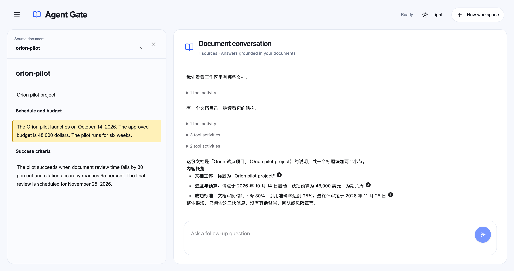
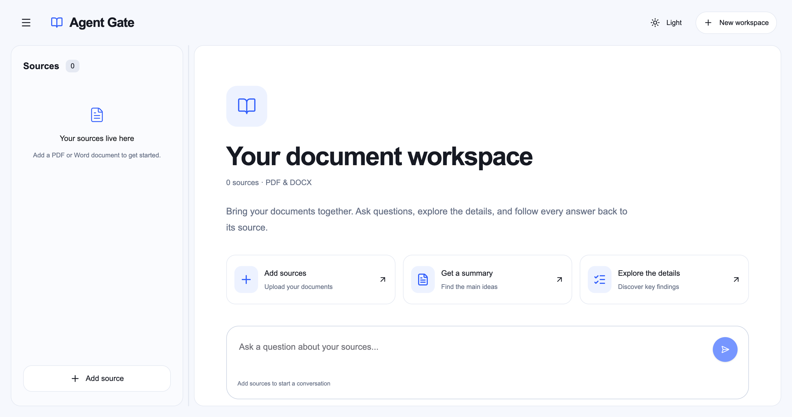
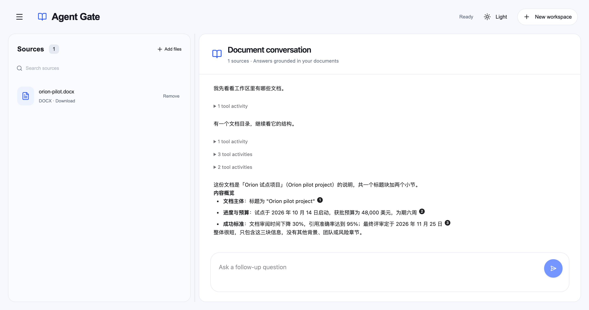
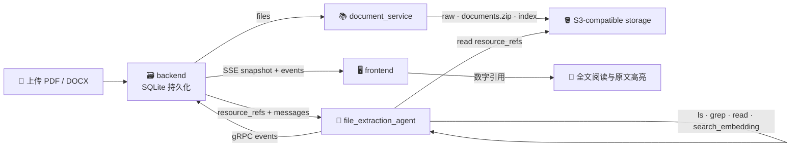

<p align="center">
  <h1 align="center">TraceAgent</h1>
  <p align="center">
    <strong>Evidence-grounded Document QA - 让每个回答都能追溯到原文</strong>
  </p>
  <p align="center">
    <code>FastAPI</code> · <code>LangGraph</code> · <code>Next.js</code> · <code>SSE</code>
  </p>
  <p align="center">
    <a href="README.ja.md">日本語</a> · <a href="#demo">Demo</a> · <a href="#quickstart">Quick Start</a> · <a href="LICENSE">MIT License</a>
  </p>
</p>

---

> **TraceAgent 将文档回答、原文证据和工具查阅过程放在同一个工作台。**

模型回答文档事实时附带数字引用，点击即可打开原文并高亮对应内容。你可以核对它查阅了什么、读了哪里，以及结论由哪一段支撑。浏览器工作台显示为 Agent Gate。

<h2 id="demo">🎬 Demo</h2>

<p align="center">
  
</p>
<p align="center"><em>左：全文阅读与引用高亮 · 右：工具过程、回答与数字引用</em></p>

截图来自本地实际运行的工作台和已有 Orion 示例文档会话，更新于 2026-10-02。

<table>
<tr>
<td width="50%">

<p align="center"><em>首页：添加文档、摘要与问题草稿入口</em></p>
</td>
<td width="50%">

<p align="center"><em>会话：来源管理、工具过程与带引用的回答</em></p>
</td>
</tr>
</table>

## ✨ 核心亮点

| &nbsp; | 功能 | 说明 |
|:---:|---|---|
| 💬 | **多轮文档 QA** | 上传 PDF / DOCX，围绕同一批文档连续追问 |
| 🔗 | **数字引用** | 回答中的文档链接绑定 Markdown 块，显示为可点击的数字引用 |
| 📖 | **原文 Review** | 点击引用在左侧打开全文，高亮目标块并保留前后章节 |
| | **来源管理** | 逐文件显示处理状态，支持失败重试、补传、下载与删除 |
| | **会话恢复** | 最近会话来自后端数据库，刷新或打开会话链接可恢复文件与历史 |
| 🧭 | **过程可见** | 展示模型浏览目录、搜索关键词、阅读片段的完整轨迹 |
| 🛑 | **可取消生成** | 随时取消当前回答，后端立即终止 agent 循环 |
| 📄 | **多格式** | PDF（MinerU OCR）与 DOCX（python-docx）解析为 HTML，再生成 Markdown 文件树与 embedding 索引 |

## 🧠 工作原理


```mermaid
flowchart LR
    Upload["📄 上传 PDF / DOCX"]
    Upload --> Backend["🗃️ backend<br/>SQLite 持久化"]
    Backend --> |"files"| Document["📚 document_service"]
    Document --> |"raw · documents.zip · index"| Storage["🪣 S3-compatible storage"]
    Backend --> |"resource_refs + messages"| Agent["🤖 file_extraction_agent"]
    Agent --> |"read resource_refs"| Storage
    Agent --> |"ls · grep · read · search_embedding"| Agent
    Agent --> |"gRPC events"| Backend
    Backend --> |"SSE snapshot + events"| Frontend["🖥️ frontend"]
    Frontend --> |"数字引用"| Review["📖 全文阅读与原文高亮"]
```

TraceAgent 将文档映射为**只读虚拟仓库**。模型通过 `ls` / `grep` / `read` / `search_embedding` 浏览目录、搜索关键词、读取正文或检索语义相近的片段，工具过程和回答通过 SSE 实时推送到前端。

浏览器通过 Next.js 代理访问 backend。backend 校验上传文件，通过独立 document service 准备资源，再将资源引用和消息历史交给 agent 执行问答。SQLite 保存会话、资源引用、轮次和完整消息；恢复页面时先读取快照，再订阅活跃轮次。过程增量只在内存中广播，历史工具活动由已保存的工具调用和结果恢复。

> 详细架构设计见 [`agent/docs/DESIGN.md`](agent/docs/DESIGN.md)

<h2 id="quickstart">⚡ Quick Start</h2>

**1. 创建环境**

```bash
conda create -n agent-gate python=3.11 -y && conda activate agent-gate
```

**2. 安装依赖**

```bash
./scripts/install.sh          # 安装 Python 包 + 构建前端
```

安装包含 storage 服务及默认 OpenVINO embedding 依赖。document service 启动时会加载并预热 embedding 模型，首次加载需要从 Hugging Face 下载；预热成功后才开始监听。

若公开模型下载返回 401，而匿名访问正常，可在 `.env` 设置 `HF_HUB_DISABLE_IMPLICIT_TOKEN=1`，避免自动发送本机已有的 Hugging Face token；需要访问私有模型时应使用有效凭据。

**3. 配置环境变量**

在仓库根目录创建 `.env`，启动脚本会自动读取：

```bash
BASE_URL="https://your-model-endpoint/v1"
OPENAI_API_KEY="your-api-key"
MODEL="your-model-name"
MODEL_API_TRANSPORT="responses"

DOCUMENT_PROCESSOR_MINERU_LANG="japan"

AGENT_PORT=8001
DOCUMENT_PORT=8002
BACKEND_PORT=8000
FRONTEND_PORT=3000
STORAGE_PORT=9000
```

**4. 启动服务**

```bash
./scripts/start.sh            # 启动 storage / agent / document service / backend / frontend
```

默认先启动本地 storage，数据保存在 `storage/data`，可用 `STORAGE_DATA_ROOT` 改目录。若使用已有 S3 兼容服务，在 `.env` 配置 `S3_ENDPOINT_URL`，脚本会复用该地址并跳过本地 storage。退出脚本时会停止本次启动的服务。

打开 http://127.0.0.1:3000 即可使用。

1. 点击 Add source / Add sources 选择 PDF 或 DOCX，文件即进入串行处理队列。单次选择最多 20 个文件、合计 32 MiB，空文件不支持。
2. 文件全部处理完成后自动进入 `/tasks/{session_id}`。输入问题并发送；Get a summary 和 Explore the details 只填写可编辑草稿。
3. 点击回答中的数字引用，在左侧查看全文和高亮块；关闭阅读器可回到 Sources，通过 Add files 补传文档。
4. 点击左上角菜单打开 Recent workspaces，或再次打开会话链接，恢复同一后端数据库中的文件与历史。

默认数据库为 `backend/backend.sqlite3`，可通过 `BACKEND_DATABASE_PATH` 配置。当前面向单用户本地运行，backend 使用单进程；没有租户鉴权，旧 `qa_*` 数据不自动迁移。

> 详细配置和设计：[`agent/`](agent/README.md) · [`document_service/`](document_service/README.md) · [`backend/`](backend/README.md) · [`frontend/`](frontend/docs/DESIGN.md)

## 🗺️ 项目结构

```
agent_proto/      共享协议 - agent 与 document service 的 protobuf/gRPC 契约
document_service/ 文档服务 - PDF/DOCX 解析、Markdown 文档树、embedding 和资源发布
storage/          对象存储 - 本地 S3 兼容 HTTP 服务
shared/           共享基础设施 - object store 客户端
agent/            AI 能力层 - QA Agent（LangGraph 驱动）
backend/          持久化与编排 - sessions / resources / turns / messages（SQLite）
frontend/         浏览器工作台 - 来源管理、QA stream、工具过程与原文阅读（Next.js）
```

## 📄 License

[MIT](LICENSE)
