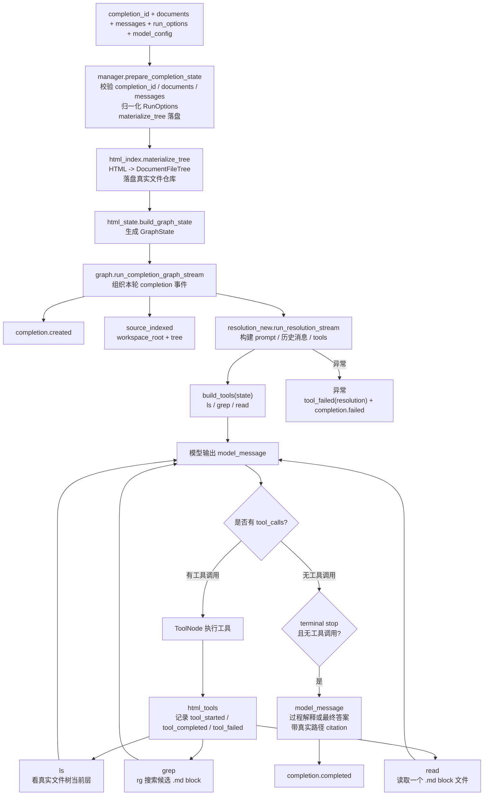

# File Extraction Agent Design

本文记录 `file_extraction_agent` 在 `dev-qa` 分支上的当前设计：它已经从“按 `task_spec` 抽取字段”的 agent 重构为“多文档 QA chat completion agent”。模块仍沿用历史包名，但语义已经变成 document QA：backend 每轮把 `documents + append-only messages` 传入，agent 把 HTML 落成真实文件树，像 code agent 浏览代码仓库一样浏览它，并通过 SSE 持续输出 `model_message`、工具事件和终态事件。

核心目标是**过程可追溯**：模型会在阅读过程中用真实文件路径的 Markdown evidence link 解释每个文档事实和阶段性判断；最终回答像 NotebookLM 一样把数字 evidence citation 紧跟在被支撑的句子后面。用户可以看到模型看了哪些文档、搜了什么、读了哪些 block 文件，以及每个最终结论句引用了哪些来源。

## 1. 当前边界

`file_extraction_agent` 只负责一次 QA completion 的执行，不负责上传文件、会话持久化、前端 SSE 续传或数据库写入。

```text
backend 持久化 task / messages / documents / events
  -> 每轮用户输入生成 completion_id
  -> 调用 agent POST /v1/document-qa/chat/completions
  -> agent 把 documents 落盘成真实文件树并运行 model/tool loop 返回 text/event-stream
  -> backend 消费 SSE、入库、转发给前端、追加 messages
  -> agent completion 结束后清理本轮 workspace 并释放运行时热状态
```

第一版 agent 内部只保存 active completion 的内存状态，用于当前流和取消；它不保存完整历史消息，也不把 SQLite / LangGraph checkpointer 当成会话事实来源。

配套草稿文档：

- [flowchart.md](flowchart.md)：描述 chat completions、cancel 和 agent loop 的高层流程。
- [agent_loop.md](agent_loop.md)：描述更轻量的协作式 cancel 伪代码；在 backend 作为事实来源时，agent 只需要在安全点检查 `cancel_flag` 并尽快停止。
- [tools.md](tools.md)：描述 `ls/read/inspect/grep` 等工具表面，以及尚未实现的 `fuzzy_search` 设想。

## 2. 输入、输出和运行步骤

Python 入口是 `manager.create_completion_stream(...)`：

```text
completion_id + documents + messages + run_options + model_config
  -> manager.prepare_completion_state(...)（校验函数，失败抛 ValueError）
       -> 校验 completion_id 非空
       -> 校验 documents 是非空 list，且每个 InputDocument 有 filename/html
       -> 校验 messages 是非空 list，支持 OpenAI 风格 user/assistant/tool 消息
       -> run_options 缺省补成 RunOptions(max_tool_calls=200)，并要求 max_tool_calls > 0
       -> html_index.materialize_tree(documents, workspace_root/<completion_id>) 落盘真实文件树
       -> build_graph_state(...) 产出 GraphState（不再有 DocumentQaCompletionInput 包装对象）
  -> manager.CompletionManager.create 创建 ActiveCompletion 并放入其注册表
  -> model_factory.build_resolution_model(model_config) 构建 LangChain chat model
  -> manager 启动 producer 线程运行 graph.run_completion_graph_stream(...)
       -> 输出 completion.created
       -> 输出 source_indexed(workspace_root + tree)
       -> resolution_new.run_resolution_stream(...)
            -> build_resolution_messages，把历史 OpenAI messages 原样转成 chat/tool messages
               并保持最新真实用户消息为最后一条 human message
            -> build_tools(state) 暴露 ls / grep / read
            -> 模型产生 model_message，先校验 provider stop signal 与 tool_calls 是否一致
            -> 有 tool_calls 时保留同轮一个或多个工具调用并交给 ToolNode 执行；terminal stop signal 且无工具时自然结束
       -> resolution 正常结束输出 completion.completed
       -> resolution 异常输出 tool_failed(resolution) + completion.failed
       -> producer 把每条 SSE event 放入 runtime queue
  -> manager 的 SSE consumer 从 runtime queue 取 event 并向 HTTP response yield
       -> 无事件时阻塞等待 runtime queue
       -> cancel endpoint 通过 runtime 往 queue 放入 cancel sentinel，主动唤醒 consumer
       -> consumer 按 FIFO 先发出 cancel sentinel 之前已提交的普通 event
       -> consumer 收到 cancel sentinel 后输出 completion.cancelled 并结束 stream，不等待 provider 下一个 chunk
       -> producer 后续若从 provider 返回更多 event，看到 runtime 已结束后丢弃
  -> finally 从 CompletionManager 注册表移除本轮 completion
```

公开边界全部强类型化：`create_completion_stream` 的 `documents` 只接收
`list[InputDocument]`、`messages` 只接收 `list[DocumentQaMessage]`、
`model_config` 只接收 `ModelConfig | None`、`run_options` 只接收
`RunOptions | None`；不再接收 `list[Any]` / `dict` / duck-typed object。
不存在独立的 `DocumentQaCompletionInput` 包装对象或 `input_adapter` 模块：
校验、派生 `workspace_root` 和触发 `materialize_tree` 落盘都收进
`manager.prepare_completion_state(...)`，它直接产出 `GraphState`。
`routes` 层通过 Pydantic `ChatCompletionRequest` 把 JSON 转成强类型对象后
（含 `RunOptions`/`ModelConfig`）再交给 entry。

整体流程图：



输出是 SSE 字符串迭代器，每条形如：

```text
event: model_message
data: {"seq":4,"type":"model_message","content":"..."}

```

失败时主要有两类：

- 入参校验失败：`manager.prepare_completion_state(...)` 或 Pydantic schema 抛出 `ValueError`，HTTP route 映射为 422。
- resolution 运行失败：`graph` 捕获异常，先输出 `tool_failed`，再用 `completion.failed` 收口。

## 3. Cancel 和 Provider Stream 边界

当前目标设计把 agent 的 SSE 输出拆成 producer / consumer 两层，避免 cancel 被上游 provider stream 卡住：

```text
HTTP SSE consumer
  -> 阻塞等待 runtime.queue.get()
  -> 有 event 就 yield 给 backend
  -> 收到 cancel sentinel 时 close_once("cancelled")
  -> close_once 成功则 yield completion.cancelled 并关闭本轮 SSE

producer 线程
  -> 运行 graph.run_completion_graph_stream(...)
  -> graph 内部可能阻塞在 LangChain/OpenAI provider.stream()
  -> 每次 provider 请求必须使用明确 request timeout，不能无限等待
  -> provider 吐出 chunk 后继续生成 model/tool/completion event
  -> 如果 runtime 已 cancelled/closed，丢弃后续 event
```

这里的 cancel 语义是“本地 run 立刻收口”，不是保证上游 provider 物理停止生成。同步 SDK 如果卡在阻塞 IO 中，Python 不能安全强杀该调用；agent 能保证的是 `/cancel` 通过 runtime 设置取消状态并向本轮 runtime queue 投递 cancel sentinel，主动唤醒原 SSE consumer。consumer 不需要 timeout 轮询，也不等待 provider 下一个 chunk，而是把 cancel sentinel 之前已经提交到 queue 的普通 event 按 FIFO flush 给 backend，然后输出 `completion.cancelled` 并释放响应链路。

cancel 的精确边界由 runtime lock 上的提交顺序定义，而不是由用户点击取消的现实时间定义：

```text
producer commit_events([event_a, event_b]) 先拿到 runtime lock
  -> event_a/event_b 都成功进入 runtime queue，成为已提交 event
  -> cancel 后拿到 lock，只能把 cancel sentinel 排在 event_b 后面
  -> consumer 必须依次 yield event_a、event_b、completion.cancelled

cancel request_cancel() 先拿到 runtime lock
  -> cancel sentinel 进入 runtime queue
  -> runtime 进入 cancelling/closed 边界
  -> producer 后续 commit_events([...]) 发现 runtime 已取消，整批不入队
```

因此 `request_cancel()` 只阻止 cancel sentinel 之后的新 event 入队，不能丢弃 sentinel 之前已经成功提交的旧 event。producer 可以单条提交，也可以小批量提交已经在锁外生成好的 event；但提交临界区只能做状态检查和 `queue.put`，不得包含 provider stream、tool 调用、graph 运行或其他慢 IO。小批量提交的代价是 cancel 粒度变成 batch 之间；只要 batch 是很短的内存提交，就不会造成锁长期占用。

为了避免 producer/consumer 只是把卡死从前台链路挪到后台线程，provider 请求必须有有限 timeout。timeout 和重试等待采用 Ethernet binary exponential backoff 思路：同一个 completion 内最多重试五次，第 `k` 次失败后从 `[0, 2^k - 1]` 个离散 slot 中随机选择等待时长，再发起下一次 provider 调用；slot 基准时长和单次 request timeout 可由配置覆盖，但都必须是有限秒数，不能配置成无限等待。每次 provider 调用都使用明确 request timeout；如果因为 timeout 失败且还有剩余尝试，就按随机退避等待后切到下一 transport/attempt 或同 transport 重试；如果五次耗尽：

```text
runtime.cancel_requested=true
  -> producer 安静退出，consumer 已经负责输出 completion.cancelled

runtime.cancel_requested=false
  -> producer 输出 tool_failed(resolution) + completion.failed
```

因此后台 producer 最多残留到当前 provider request timeout 结束，连续 cancel 不会无限堆积僵尸线程；随机退避还能避免多个 completion 在同一时间点同时重试上游 provider。后续如果把 provider transport 改成原生 async/httpx stream，cancel 时还应主动 close socket；但即使有主动 close，有限 request timeout 和随机指数退避仍然是最后的资源回收边界。

线程安全约束：

```text
ActiveCompletion
  -> 内部持有 threading.Lock
  -> 持有本 completion 专属 runtime queue，queue 不与其他 completion 共享
  -> cancel_requested/status/closed 只能通过方法读写
  -> 状态检查、状态变更和 queue.put 必须在同一个 runtime lock 临界区里完成
  -> request_cancel() 标记取消意图，并向 runtime queue 放入 cancel sentinel 唤醒 consumer
  -> close_once(status) 原子决定唯一终态

CompletionManager._completions
  -> 所有 get/set/pop 都必须持有自身的 registry lock
  -> CompletionManager.create(...) 注册 runtime 后才能返回 SSE iterator
  -> registry 只保存 completion_id -> runtime 的索引；queue 是 runtime 私有字段，不存在全局共享 queue
  -> runtime close 后从 registry 移除

producer -> consumer event queue
  -> 如果 consumer 是 async generator，producer 线程只能通过 loop.call_soon_threadsafe(...) 投递事件
  -> 如果使用同步 StreamingResponse generator，则使用线程安全 queue.Queue
  -> 禁止 producer 线程直接操作 asyncio.Queue
  -> 已经 commit 到 queue 的普通 event 必须按 FIFO 发出，不因后续 cancel 被丢弃
  -> cancel sentinel 之后的普通 event 不允许再 commit；producer 迟到 event 直接丢弃
```

`queue.Queue` 自己的内部锁只保证队列数据结构线程安全，不保证业务上的 cancel 顺序。业务顺序必须由 `runtime.lock` 统一线性化：

```text
runtime.commit_events(events)
  -> with runtime.lock
  -> 如果 runtime 已 cancelling/closed，整批 event 不入队
  -> 否则把 events 逐个 queue.put，形成一个已提交 batch

runtime.request_cancel()
  -> with runtime.lock
  -> 如果 runtime 已 closed/cancelling，直接返回当前状态
  -> 否则设置 cancel_requested=true、status=cancelling
  -> 在同一个临界区内 queue.put(cancel sentinel)
```

不能先改 `cancel_requested` 再在锁外放 sentinel，也不能先放 sentinel 再在锁外改状态；否则 producer、consumer 看到的 runtime 状态和 queue 顺序可能不一致。consumer 可以阻塞在 `runtime.queue.get()` 上，但阻塞等待时绝不能持有 `runtime.lock`。

consumer 的结束条件来自 queue item，不直接读取 `cancel_requested`：

```text
consumer queue.get() -> 普通 event
  -> 这个 event 已经在 producer/cancel 线性化点之前成功提交
  -> consumer 直接按 FIFO yield 给 backend，不再用 cancel flag 二次裁决

consumer queue.get() -> cancel sentinel
  -> runtime.close_once("cancelled")
  -> close_once 成功才 yield completion.cancelled
  -> 结束本轮 SSE

consumer queue.get() -> completion.completed / completion.failed
  -> runtime.close_once("completed" / "failed")
  -> close_once 成功才 yield 对应终态
  -> 结束本轮 SSE
```

`cancel_requested` 只服务于入队侧：producer 用它判断后续 event 能不能 commit，cancel handler 用它避免重复塞 sentinel。consumer 如果用 `cancel_requested` 直接停流，会跳过 sentinel 前已经提交的旧 event，破坏 FIFO 语义。

终态事件只能发一次。cancel consumer、producer 正常完成和 producer 失败都会竞争调用 `runtime.close_once(status)`：

```text
consumer 收到 cancel sentinel
  -> close_once("cancelled") 成功：yield completion.cancelled 并结束 SSE
  -> close_once(...) 失败：说明 producer 已经先完成，consumer 不再发第二个终态

producer 生成 completion.completed / completion.failed / completion.cancelled
  -> close_once(status) 成功：把该 terminal event 投递给 consumer
  -> close_once(...) 失败：说明 cancel 或其他终态已经生效，丢弃该 event 并退出
```

同一个 `completion_id` 不能同时出现 `completion.cancelled`、`completion.completed` 或 `completion.failed` 中的多个终态；谁先原子关闭 runtime，谁就是唯一结果。

## 4. 真实文件树

多文档语料被落盘成一个真实文件 tree，模型像 code agent 看项目一样浏览。
每个输入 HTML 先变成一个文档目录；文档目录名会优先使用第一个 `h1` 或
`title` 作为标题后缀，但正文里的所有 `h1` 到 `h6` 都仍然会按层级生成
section 目录，不会因为第一个 `h1` 已经参与文档命名就被跳过：

```text
/tmp/qa_workspace/<completion_id>/
    └── 0001-contract-Agreement/
        └── 0001-Agreement/
            ├── 0001-Termination/
            │   ├── 0001-Either party may terminate.md
            │   └── 0002-Notice period.md
            └── 0002-Notices/
                └── 0001-Written notice must be sent.md
```

建模规则：

- 每个输入 HTML 是 workspace 根目录下的文档目录，目录名数字前缀按文档顺序递增。
- 文档标题只决定文档目录显示名；同一个 `h1` 仍会作为正文 section 目录进入树，
  多个 `h1` 会成为文档目录下的多个一级 section。
- `h2` 到 `h6` 按 HTML heading 层级挂到最近的更高层 section 下面。
- section header 是目录；paragraph/list/table 是 `.md` 文件（列表和表格整表一个文件）。
- 目录 / 文件排序靠数字前缀（`0001-` / `0002-`），不靠 `os.listdir`。
- 没有 `path_id` / `evidence://`；模型看到和引用的都是真实 `.md` 文件路径。
- `source_indexed` 事件暴露 `workspace_root` 和逐层 `tree` 清单。

## 5. 工具设计

当前只暴露三个模型工具：

```text
ls(path="")
grep(query, scope="", max_results=20)
read(path="/abs/.../0001-section/0001-block.md")
```

已删除旧字段抽取工具：`add_candidate_evidence`、`review_evidences`、
`write_field`、`submit_result`。也删除了旧的 `inspect`、`evidence://` /
`path_id` locator 和 `evidence://range` 连续读取。QA 模式不设置 `answer` 或
`finish` 工具；模型消息只有在 provider 给出 terminal stop signal（例如
`finish_reason=stop` 或 `stop_reason=end_turn`）且没有工具调用时才被视为本轮
自然结束，SSE 用 `completion.completed` 收口。对应的 `model_message` 会带
`is_final=true` 和归一化后的 `stop_signal`，backend 只用这个标记决定哪条
assistant 文本进入下一轮历史。如果 provider 给出 `finish_reason=tool_calls`、
`stop_reason=tool_use`、`length/max_tokens` 等非终态信号但 LangChain 消息没有
实际 `tool_calls`，agent 会把该 transport 视为不完整并继续 fallback。

### `ls`

`ls` 列出 workspace 根、文档目录或 section 目录的当前一层，用于让模型逐层
理解多文档结构，避免一次工具调用把深层目录全部塞进上下文。

```text
用户问题
  -> ls(path="")
  -> 模型看到文档目录路径
  -> ls(path="/tmp/qa_workspace/<cid>/0001-contract")
  -> 模型看到该文档当前层的 section 或 .md 文件路径
  -> 选择下一步 grep、read 或继续 ls 子 section
```

`ls` 的输出可以作为结构性 evidence，但不能支撑具体日期、金额或义务结论。

### `grep`

`grep` 对应 code agent 里的 `rg`，用于在全部 `.md` block 中找候选。

```text
grep(query="termination", scope="/tmp/.../0001-contract/0001-Termination", max_results=20)
  -> 在 scope 目录跑 rg 子进程，stdout 原样返回（带文件路径 + 行号 + 匹配行）
  -> 不限定 scope 时在整个 workspace 根目录搜索
```

`grep` 只返回候选行，不是最终证据。模型需要继续 `read` 具体文件确认。

### `read`

`read` 打开一个 `.md` block 文件，返回其 markdown 内容：

```text
read(path="/tmp/qa_workspace/<cid>/0001-contract/0001-Termination/0001-Either party may terminate.md")
  -> open().read() 返回该段落的 markdown 文本
```

`read` 返回 Markdown 阅读视图。段落返回纯文本，列表返回 bullet，表格返回
markdown 表格（整表一个文件）。模型用它理解上下文、做阶段性概括，并据此
引用文件路径作为证据。

## 6. Evidence 和过程消息规则

QA 的证据主容器是 `model_message`，不是最终提交工具。过程 `model_message` 对文档做事实陈述时，应在首次陈述时携带带可读 label 的 Markdown evidence link；最终 `model_message` 用 `is_final=true` 标记，并把数字 label 的 evidence citation 紧跟在被支撑的句子后面，不再收束成末尾 `Sources` 区。

```text
检索策略、下一步行动说明
  -> 不需要 evidence，因为它不是文档事实

文档结构、section 主题、阅读路径说明
  -> 可使用 section 或 block 文件路径

过程中的具体事实、日期、金额、义务、条件、例外、冲突
  -> 应引用被 read 的 .md 文件路径

最终回答正文里的文档事实
  -> 正文先写结论和说明，再把 [1](/abs/path/...md) 这类数字 citation 紧跟在对应句子后面
```

推荐输出节奏：

```text
model_message: 我先查看终止和通知相关内容，因为问题问的是能否提前终止。
工具: grep("terminate")
model_message: 命中集中在 Termination 章节，我先读该章节。[Termination](/abs/0001-contract/0001-Termination)
工具: read("/abs/0001-contract/0001-Termination/0001-termination.md")
model_message: 这里说明任一方可以终止协议，但该句本身没有写提前通知天数。[任一方可以终止](/abs/0001-contract/0001-Termination/0001-termination.md)
model_message(is_final=true): 可以提前终止。[1](/abs/0001-contract/0001-Termination/0001-termination.md) 还需要满足书面通知要求。[2](/abs/0001-contract/0001-Notices/0001-notices.md)
```

多轮上下文只来自 backend 传入的 append-only `messages`：上一轮 user/assistant/tool 历史会原样保留并追加新问题。agent 不接收 memory、摘要或自动裁剪结果，避免每轮重写上下文导致 provider prompt cache 失效。新一轮如果复用旧发现，仍应引用原始 `.md` 文件路径。

QA prompt 的默认行为不是强制查文档。模型如果能从当前对话上下文、助手身份或能力说明直接回答，就直接回答；只有用户询问文档内容、要求证据，或当前对话不足以回答时，才使用 `ls/grep/read`。一旦使用文档工具，模型需要给出简短可见的 investigation trace，说明查了什么、发现了什么、还缺什么；但不能输出隐藏推理。evidence link 只约束来自文档的事实，非文档回答不需要硬贴 evidence。过程消息使用可读 citation label；最终回答使用 `[1](/abs/path/...md)`、`[2](/abs/path/...md)` 这类数字 label，并把数字 citation 放在被支撑句子后面，不收束成一个总 `Sources` 区。

## 7. HTTP API

当前 route 暴露：

```text
POST /v1/document-qa/chat/completions
GET  /v1/document-qa/chat/completions/{completion_id}
POST /v1/document-qa/chat/completions/{completion_id}/cancel
```

### 创建 completion

请求体：

```json
{
  "completion_id": "cmp_456",
  "documents": [
    {"filename": "contract.pdf", "html": "<h1>Agreement</h1><p>...</p>"}
  ],
  "messages": [
    {"role": "user", "content": "这份合同可以提前终止吗？"}
  ],
  "stream": true,
  "metadata": {"task_id": "task_001", "turn_id": "turn_003"},
  "run_options": {"max_tool_calls": 80},
  "model_config": {
    "base_url": "https://example.com/v1",
    "api_key": "...",
    "model": "...",
    "api_transport": "responses"
  }
}
```

`api_transport` 只支持 `responses` 或 `chat_completions`。每个 transport 内部仍按 stream -> invoke 做 fallback；不会在 Responses API 失败后自动切到 chat/completions。当前实现总是以 `text/event-stream` 返回流；`stream=false` 暂未实现为非流式响应。

### 查询 completion

`GET /v1/document-qa/chat/completions/{completion_id}` 当前是占位调试入口，返回：

```json
{"status": "not_implemented"}
```

如果后续需要查询 active runtime 状态，应在不引入持久 conversation 的前提下扩展这里。

### 取消 completion

```text
POST /v1/document-qa/chat/completions/{completion_id}/cancel
  -> completion_manager.terminate(completion_id)
  -> 如果 completion 在 CompletionManager 注册表中，设置 cancel_requested=true、status=cancelling
  -> create_completion_stream 的 SSE consumer 被 cancel sentinel 唤醒
  -> consumer 先 flush sentinel 前已提交的普通 event，再输出 completion.cancelled 并关闭 SSE
  -> producer 若稍后从 provider 返回事件，会在 runtime 已关闭时丢弃
  -> 如果找不到 active completion，返回 status=not_found
```

示例响应：

```json
{"id": "cmp_456", "status": "cancelling"}
```

当前取消是本地 completion 级取消：不强杀进程、线程或正在进行中的同步 provider 请求，但会让 SSE consumer 不等 provider 下一个 chunk；consumer 会先按 FIFO 发出 cancel sentinel 前已经提交的普通 event，再用 `completion.cancelled` 收口。残留 producer 依赖有限 request timeout 回收，迟到事件会被丢弃。第一版必须按单进程/单 worker 部署；如果使用多个 uvicorn worker，`/cancel` 可能打到另一个进程而找不到 `_ACTIVE_COMPLETIONS` 中的 runtime。未来需要多进程或多实例时，应把 active runtime/cancel 信号移到 Redis、队列或其他外部共享运行时。

## 8. 事件模型

SSE 事件按 `seq` 递增，常见类型如下：

| 事件 | 来源 | 作用 |
| --- | --- | --- |
| `completion.created` | graph | 标记本轮 completion 开始。 |
| `source_indexed` | graph | 暴露本轮 `workspace_root` 和逐层 `tree` 清单。 |
| `model_message` | resolution | 模型面向用户的过程说明或最终回答；过程事实应内嵌带可读 label 的 evidence link，最终回答带 `is_final=true` 和 `stop_signal`，并把数字 evidence citation 放在被支撑句子后面。 |
| `tool_started` | html_tools | 记录工具开始及参数。 |
| `tool_completed` | html_tools | 记录工具成功结果。 |
| `tool_failed` | html_tools / graph | 记录工具或 resolution 失败。 |
| `completion.completed` | graph | 正常结束。 |
| `completion.cancelled` | manager | 后端请求取消后结束。 |
| `completion.failed` | graph | resolution 失败后结束。 |

backend 应把这些事件作为事实流持久化；前端断线续传和历史回放应读取 backend 数据库，而不是依赖 agent 仍保留 runtime。

## 8. 模块职责

```text
schemas.py
  -> 定义 InputDocument / DocumentQaMessage / DocumentQaCompletionRequest / ModelConfig / RunOptions

impl/html_index.py
  -> 解析语义 HTML
  -> 构建 DocumentFileTree（真实目录 + .md 文件）
  -> 提供 entries / read / scope_path；不再有 path_id / source_selectors / 句行级 selector

impl/html_state.py
  -> 定义 GraphState
  -> 保存本轮 completion_id、DocumentFileTree、messages、run_options、events、actions、next_seq

impl/html_tools.py
  -> 构建 ls / grep / read
  -> 每次工具调用写入 tool_started/tool_completed/tool_failed 事件
  -> grep 用真实 rg 子进程返回原样 stdout；引用证据用真实 .md 文件路径

impl/resolution_new.py
  -> 构建 QA system prompt，并保留 backend 传入的真实 chat/tool messages
  -> 用 LangGraph 运行 model/tool loop
  -> 记录 model_message
  -> 保留 provider 返回的一个或多个 tool call，并由 ToolNode 执行

impl/graph.py
  -> 组装 completion.created/source_indexed/resolution/terminal event
  -> 把事件序列化成 SSE 字符串

manager.py
  -> prepare_completion_state(...) 做入口校验（非空、filename/html 非空、max_tool_calls > 0）、
     派生 workspace_root、触发 materialize_tree 落盘并产出 GraphState（失败抛 ValueError）
  -> CompletionManager 类统一管理 completion 生命周期：create(...)（校验/落盘/注册/起 producer/返回 SSE）、
     terminate(completion_id)（取消）、get_status(completion_id)（查询状态）；内部持有注册表 + 锁
  -> 生命周期分 producer/consumer 两半，靠 ActiveCompletion.queue + 锁协作；
     producer 直接调 impl/graph.run_completion_graph_stream 产出事件
  -> 进程内单例 completion_manager；模块级 create_completion_stream / cancel_completion
     是到单例的薄委托，供路由与既有调用方使用
```

## 9. 已删除的旧语义

本分支不再保留旧字段抽取 API 的兼容层：

- 不再接收 `task_spec`。
- 不再暴露 `POST /v1/file-extraction-agent/extract/stream`。
- 不再输出 `result_completed(fields + trace)`。
- 不再暴露 `add_candidate_evidence / review_evidences / write_field / submit_result`。
- 不再把 agent 的终态结果当成字段提交契约；多轮会话和回答持久化由 backend 负责。
