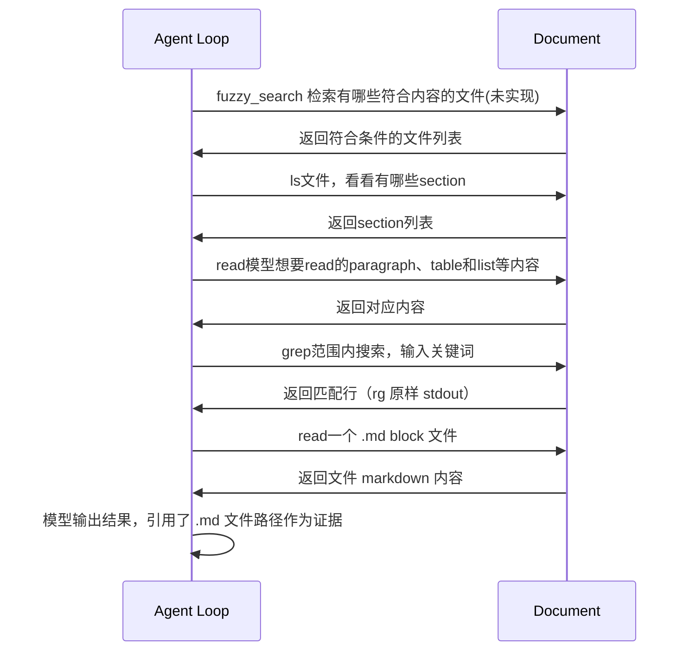

Iterable伪代码如下:
```python
while True:
    event = await message_queue.get()  # 从agent_loop的队列里取出内容
    if cancel_flag.is_set():  # 检查是否收到取消信号
        break
    yield event  # 将事件yield给SSE next()

```

Agent Loop 伪代码如下:
```python
history = [] # 存储历史消息
# 构造system prompt
system_prompt = build_system_prompt()
history.append({"role": "system", "content": system_prompt})
# 构建history messages
for message in messages:
    history.append(message)
while True:
    if cancel_flag.is_set():  # 检查是否收到取消信号
        break

    response = await client.chat.completions.create(
        model=model_config,
        messages=history,
        tools=tools,
        run_options=run_options,
    )
    # 将新消息放到queue
    await message_queue.put(response)
    # 加入history
    history.append({"role": "assistant", "content": response.choices[0].message.content})
    # 判断是否结束
    if response.choices[0].finish_reason == "stop":
        break
    # 判断是否是 tool 调用
    if response.choices[0].finish_reason == "tool_call":
        tool_response = call_tool(response.choices[0].message.tool_calls[0])
        if cancel_flag.is_set():  # 再次检查是否收到取消信号
            break
        history.append({"role": "tool", "content": tool_response})
        message_queue.put(tool_response)

```

Agent读取文档示意图
