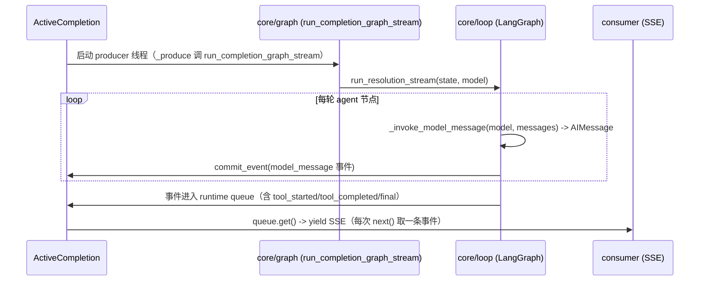

# Agent Loop

本轮 completion 的 agent loop 由 `core/loop.py`（LangGraph）驱动，被
`manager.py` 的 `ActiveCompletion._produce` 在后台线程里跑。协作式取消走
`ActiveCompletion` 的提交门（commit_*），见 `docs/DESIGN.md`。



## 驱动与停止

- producer：`ActiveCompletion._produce` 循环 `run_completion_graph_stream`，
  用 `commit_event` / `commit_terminal_event` 把每条事件投进 `runtime.queue`。
  停止点在"提交门前"：若 `cancel_requested` / `closed` / `terminal_committed` 命中，
  提交返回 `False`，producer 立即停止，已提交事件按 FIFO 保留。
- consumer：`ActiveCompletion.stream()` 返回的生成器，`queue.get()` 阻塞取事件；
  遇到 `_QUEUE_CANCEL` / `_QUEUE_DONE` / 终态事件时 `close_once` 收口。
- cancel：`completion_manager.terminate(id)` -> `runtime.terminate()`，在锁内置
  `cancel_requested=true` 并放 `_QUEUE_CANCEL` 哨兵唤醒 consumer。

## LangGraph 环（core/loop.py）

```text
agent 节点: _invoke_model_message -> _record_model_message(state, msg)
  -> should_continue: cancel_requested -> END
                      最后一条消息有 tool_calls -> tools
                      否则 -> END
tools 节点: _execute_tools_parallel 并发执行同批多个 tool_calls（ls / grep / read）
  每个工具调用带 tool_execution_timeout 超时；事件/seq 由 events_lock 保证有序
  -> should_continue_after_tools: cancel_requested -> END，否则回到 agent
```

取消是协作式的：producer 只在安全的工具批次边界检查 `state.cancel_requested`。若取消到达时正在执行工具批次，会等该批次跑完（或超时）后以 `completion.cancelled` 收口；否则由 cancel sentinel 立即收口。
