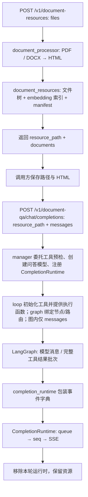
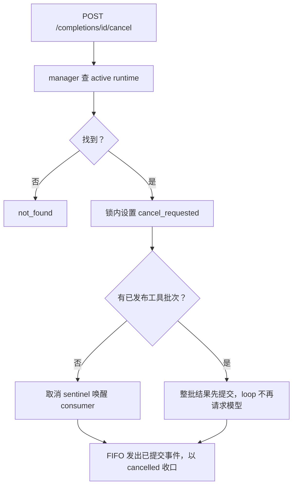

# 文档准备与问答流程图

上传入口先准备持久资源；问答入口只传路径，graph 内部初始化执行状态。

```mermaid
flowchart TD
    A["POST /v1/document-resources: files"] --> B["document_processor: PDF / DOCX → HTML"]
    B --> C["document_resources: 文件树 + embedding 索引 + manifest"]
    C --> D["返回 resource_path + documents"]
    D --> E["调用方保存路径与 HTML"]
    E --> F["POST /v1/document-qa/chat/completions: resource_path + messages"]
    F --> G["manager 委托工具预检、创建问答模型、注册 CompletionRuntime"]
    G --> H["loop 初始化工具并提供执行函数；graph 绑定节点/路由；图内仅 messages"]
    H --> I["LangGraph: 模型消息 / 完整工具结果批次"]
    I --> J["completion_runtime 包装事件字典"]
    J --> K["CompletionRuntime: queue → seq → SSE"]
    K --> L["移除本轮运行时，保留资源"]
```

## 取消

```mermaid
flowchart TD
    A["POST /completions/id/cancel"] --> B["manager 查 active runtime"]
    B --> C{"找到？"}
    C -- 否 --> D["not_found"]
    C -- 是 --> E["锁内设置 cancel_requested"]
    E --> F{"有已发布工具批次？"}
    F -- 否 --> G["取消 sentinel 唤醒 consumer"]
    F -- 是 --> H["整批结果先提交，loop 不再请求模型"]
    G --> I["FIFO 发出已提交事件，以 cancelled 收口"]
    H --> I
```

具体契约以 [DESIGN.md](DESIGN.md) 为准。
