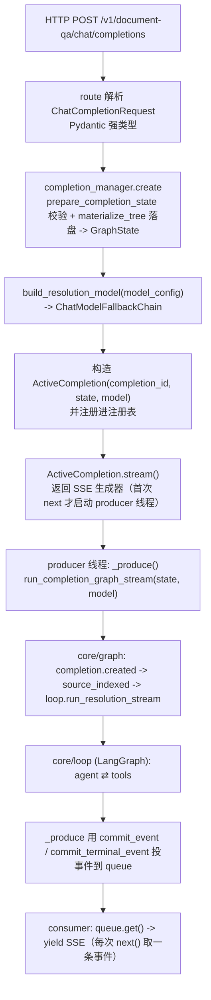

# file_extraction_agent 流程图

## chat completions



## cancel

```mermaid
flowchart TD
    A[HTTP POST /v1/document-qa/chat/completions/{id}/cancel]
    A --> B["completion_manager.terminate(id)"]
    B --> C{"在注册表找到 runtime?"}
    C -- 否 --> D["返回 not_found"]
    C -- 是 --> E["ActiveCompletion.terminate()<br/>锁内置 cancel_requested=true + 放 _QUEUE_CANCEL 哨兵"]
    E --> F["consumer 被唤醒 -> close_once('cancelled') -> 输出 completion.cancelled"]
    E --> G["producer 后续 commit 全部被拒，停止"]
```

> 注：本图描述高层线程/队列关系，实现细节以 `docs/DESIGN.md` 为准；`agent_loop.md` 见协作式取消与 LangGraph 环。
