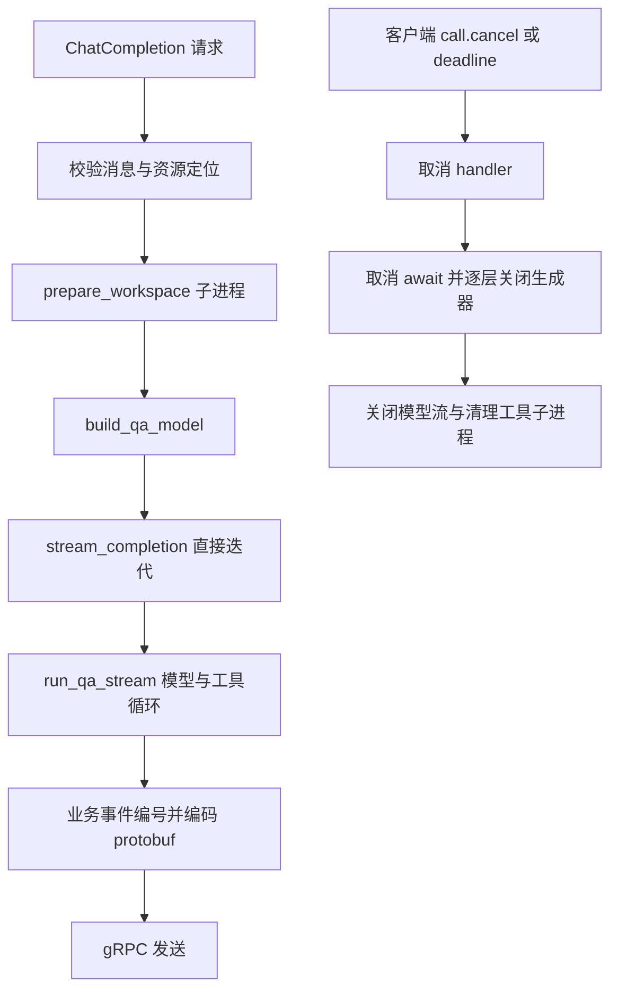

# 请求执行与取消

每个 ChatCompletion handler 直接持有一轮生成器；网络取消由 gRPC 传入，资源清理由异步调用链收尾。

```mermaid
flowchart TD
    A[ChatCompletion 请求] --> B[校验消息与资源定位]
    B --> C[prepare_workspace 子进程]
    C --> D[build_qa_model]
    D --> E[stream_completion 直接迭代]
    E --> F[run_qa_stream 模型与工具循环]
    F --> G[业务事件编号并编码 protobuf]
    G --> H[gRPC 发送]
    X[客户端 call.cancel 或 deadline] --> Y[取消 handler]
    Y --> Z[取消 await 并逐层关闭生成器]
    Z --> W[关闭模型流与清理工具子进程]
```

首事件前校验失败返回 INVALID_ARGUMENT，其他初始化失败返回 INTERNAL；执行异常输出 completion.failed。取消不产生 completion 终态，backend 自行记录业务取消状态。
