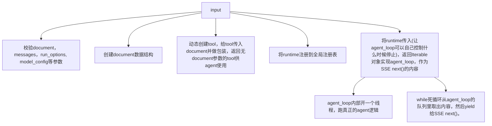
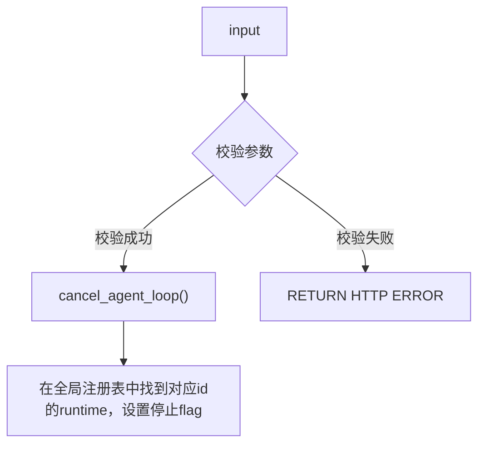

# file_extraction_agent 流程图

## chat/compltions

```mermaid
flowchart TD
    C[input] --> E[校验document，messages，run_options, model_config等参数]
    C --> F[创建document数据结构]
    C --> G["动态创建tool，给tool传入document并做包装，返回无document参数的tool供agent使用"]
    C --> H["将runtime注册到全局注册表"]
    C --> I["将runtime传入(让agent_loop可以自己控制什么时候停止)，返回Iterable对象实现agent_loop，作为SSE next()的内容"]
    I --> J["agent_loop内部开一个线程，跑真正的agent逻辑"]
    I --> K["while死循环从agent_loop的队列里取出内容，然后yield给SSE next()。"]

```

## cancel

```mermaid
flowchart TD
    input --> B{校验参数}
    B -- 校验成功 --> C["cancel_agent_loop()"]
    B -- 校验失败 --> D[RETURN HTTP ERROR]
    C --> E["在全局注册表中找到对应id的runtime，设置停止flag"]

```

