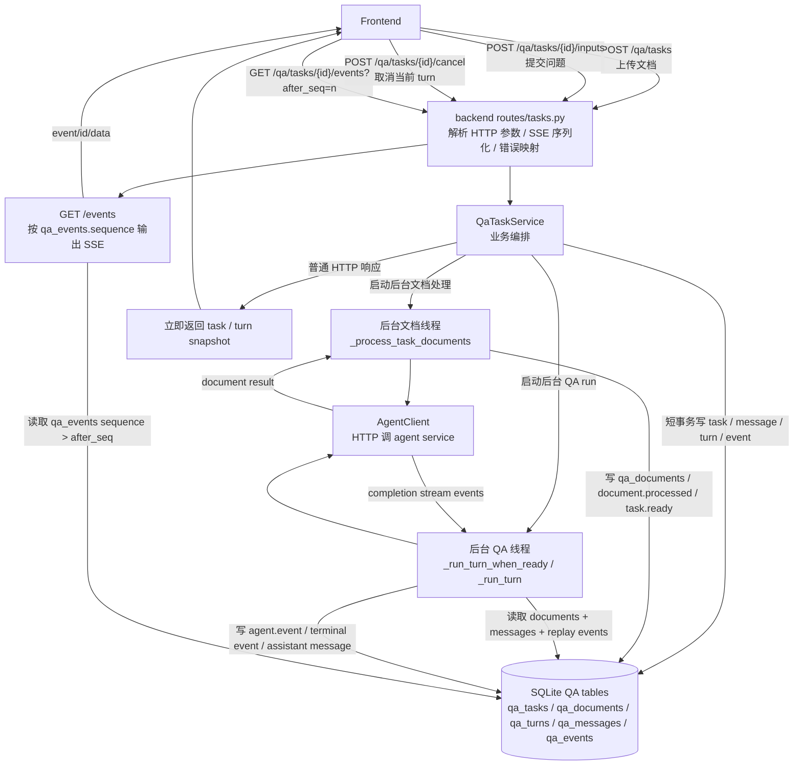
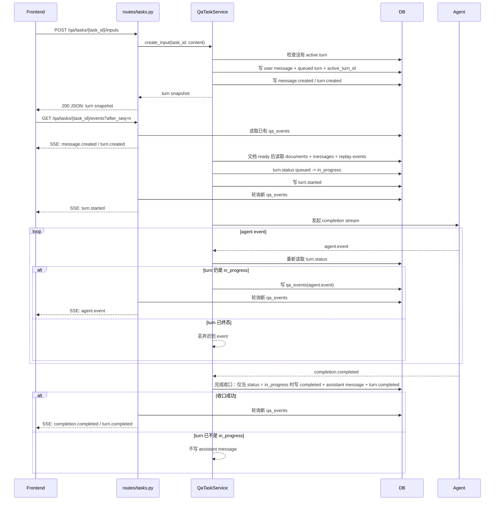
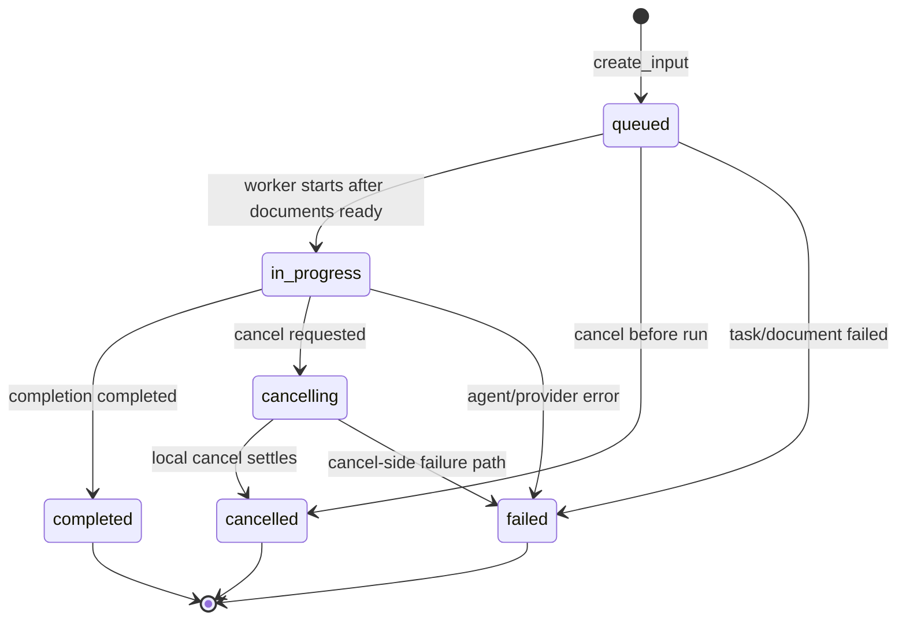
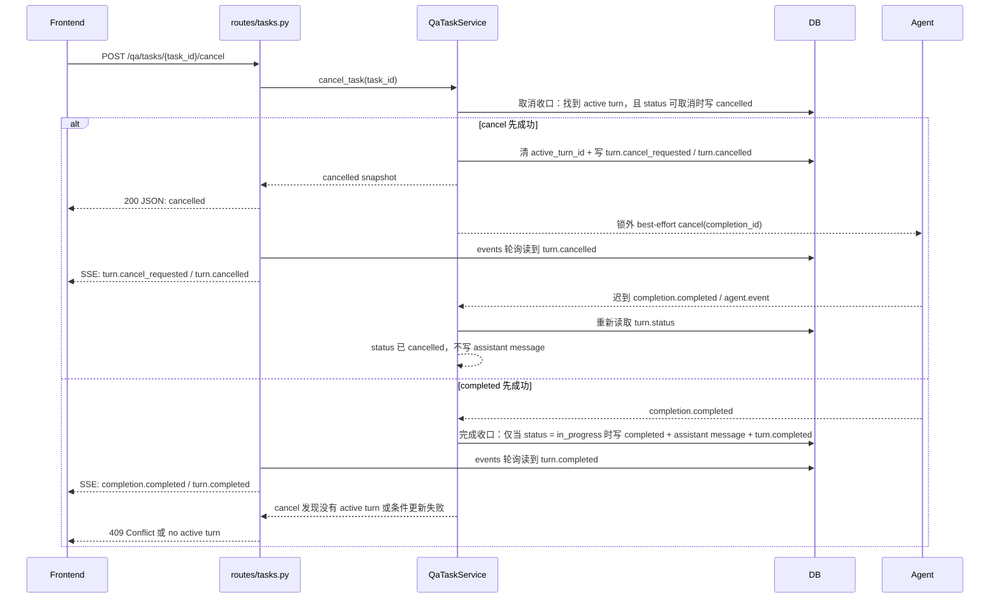

# Backend Design

这份文档是 `backend` 的设计入口。当前 backend 已破坏式重构为 QA-only：它不再执行字段抽取、字段提交、审计或 replay 组装，而是负责多文档 QA task 的文档保存、多轮消息状态、agent completion 事件持久化和取消。

接口细节见 [API.md](API.md)。

## 1. 目标与边界

backend 是多轮 QA 的持久化事实来源：

```text
上传 PDF/DOCX
  -> backend 调 agent document_processor
  -> backend 保存 qa_documents

用户提问
  -> backend 保存 user message
  -> backend 从 qa_messages + qa_events 重建 OpenAI 风格 messages：
       user / assistant / tool
     并把 documents + append-only messages 传给 agent completion
  -> backend 保存 agent model_message / tool events / terminal events
  -> backend 保存 assistant message，供下一轮上下文使用
```

为了保持 provider prompt cache 友好，backend 不维护 memory/summary 字段，也不自动裁剪或重写历史上下文。每一轮只在原有 `messages` 后追加新的 user/assistant/tool 消息；如果上下文过长，应该显式开启新 task 或在后续引入用户可见的会话切分，而不是静默摘要。

职责边界：

- `backend` 管理 QA task、documents、append-only messages、turns 和 events。
- `agent service` 负责 PDF/DOCX 标准化和单次 document QA completion。
- `backend` 通过 HTTP 调用 `agent service`，不 import `agent/` 内部包。
- `backend` 不持久化上传原始文件 bytes；只保存 document_processor 输出的 HTML/Markdown/blocks。
- `backend` 不内置业务 schema，也不接收 `task_spec`。
- `POST /qa/tasks` 和 `POST /qa/tasks/{task_id}/inputs` 都只写入任务/turn 状态后立刻返回；耗时的 document processing 和 agent completion 在 backend 后台线程里继续执行。

## 2. 项目结构

```text
backend/
  main.py
  core/
    config.py
    db.py
    storage.py
  routes/
    tasks.py
    capabilities.py
    errors.py
  crud/
    qa_tasks.py
    json_utils.py
  services/
    task_service.py
    agent_client.py
    errors.py
    time_utils.py
  models/
    schema.py
  tests/
    test_qa_task_flow.py
    test_config.py
    docs/
  docs/
    API.md
    DESIGN.md
    DEVLOG.md
    table.md
```

模块边界：

- `main.py` 初始化 SQLite、agent client 和 `QaTaskService`，挂载 routes。
- `routes/tasks.py` 只做 HTTP 参数解析、SSE 序列化和错误映射。
- `routes/capabilities.py` 提供 `/capabilities` 能力声明和 `/healthz` 轻量进程探活。
- `services/task_service.py` 编排 QA task 创建、输入、agent completion、事件写入和取消。
- `GET /qa/tasks/{task_id}` 是详情读模型：在 summary 之外返回 `qa_documents.display_html` 和最新 `source_indexed.source_selectors`，供前端 evidence link 打开右侧原文。
- `services/agent_client.py` 封装 agent service HTTP 调用。
- `crud/qa_tasks.py` 封装 QA 表读写，不做业务决策。
- `models/schema.py` 定义 QA-only SQLite schema。

数据库初始化会先清理旧字段抽取表，再处理 QA schema 的轻量升级。已有本地库如果仍保留 `qa_tasks.memory_json`，`initialize_database(...)` 会在创建缺失 QA 表之前删除该旧列并保留原有 task 行，保证 memory-free 的 `create_task(...)` 可以继续插入新任务。

## 3. 数据流

创建 QA task：

```text
POST /qa/tasks multipart(files/file, metadata)
  -> routes.tasks 读取每个 UploadFile bytes
  -> QaTaskService 校验至少一个 PDF 或 DOCX
  -> 先校验每个 filename 能推断为支持的 file_type
  -> qa_tasks 插入 processing/document_processing
  -> qa_events 写 task.created
  -> 启动后台线程 _process_task_documents(task_id, files)
  -> 立刻返回 processing/document_processing task snapshot

后台文档线程
  -> 逐个 AgentClient.process_document(...) 调 agent document_processor
       file_type=pdf  -> POST /v1/document-processor/process
       file_type=docx -> POST /v1/document-processor/docx/process
  -> qa_documents 保存 filename/html/display_html/markdown/md_list/blocks/meta/warnings
  -> 每份文档写 document.processed
  -> 如果已有 active turn，把 task 更新为 running/answering；否则更新为 ready/ready
  -> 写 task.ready
  -> 如果文档处理失败，写 task.failed；已有 active turn 时同时写 turn.failed
```

提交用户输入：

```text
POST /qa/tasks/{task_id}/inputs
  -> 校验 task 存在
  -> qa_turns 中不能已有 queued/in_progress/cancelling turn
  -> qa_messages 写 role=user
  -> qa_turns 写 queued
  -> qa_tasks 写 running/answering 或 running/document_processing + active_turn_id
  -> qa_events 写 message.created / turn.created
  -> 启动后台线程 _run_turn_when_ready(task_id, turn_id)
  -> 立刻返回 queued turn snapshot

后台 QA 线程
  -> 如果 task 仍是 document_processing，就轮询等待文档处理完成
  -> 如果 turn 已 cancelling/cancelled/failed，则直接收口
  -> qa_events 写 turn.started
  -> 组装 documents: qa_documents(filename + html)
  -> 组装 messages: qa_messages(role + content) + 同 turn 的 agent.event tool_calls / tool results
  -> AgentClient.create_document_qa_completion_stream(...)
  -> 每条 agent SSE 写 qa_events(agent.event)
  -> model_message.is_final=true 时暂存 final assistant 内容
  -> completion.completed 时，把 final assistant 内容写成 role=assistant
  -> qa_turns 写 completed
  -> qa_tasks 写 ready/ready 并清空 active_turn_id
  -> qa_events 写 turn.completed
```

取消：

```text
POST /qa/tasks/{task_id}/cancel
  -> 查找 active turn
  -> qa_turns 写 cancelling
  -> qa_events 写 turn.cancel_requested
  -> 立即写 turn.cancelled 并清空 active_turn_id，让 stream.state 变 idle
  -> 如果 turn.agent_completion_id 已有值，后台 best-effort 调 agent cancel endpoint
  -> agent cancel 成功、失败或被 provider 阻塞，都不影响 backend 已经完成的本地取消状态
```

cancel 的事实来源是 backend 本地状态，不是 agent/provider 是否已经停止生成。这样即使 agent 正在等待上游 provider stream 的下一个 chunk，用户取消也不会卡住 `/qa/tasks/{task_id}/cancel`，前端可以立即恢复输入，后续 `/events` 会通过 `turn.cancel_requested` 和 `turn.cancelled` 收口。后台 QA 线程如果稍后从 agent SSE 收到更多事件，必须在观察到 turn 已 `cancelled` 后丢弃或停止处理，不得把已取消 turn 改回 completed/failed。

backend 不能依赖 agent timeout 才完成取消；timeout 只用于降低后台残留资源占用。agent/provider 侧应使用有限 request timeout 和 Ethernet 式随机指数退避，避免旧 completion 的 producer 长时间卡在上游 stream 中，也避免多个 completion 同步重试冲击 provider。backend 自己的 agent cancel 通知也必须是短超时 best-effort，不能沿用长时间的 document/QA 请求超时。

backend 的线程安全边界：

```text
cancel_task
  -> 获取本 turn runtime lock
  -> 在 backend 本地立即写 turn.cancel_requested + turn.cancelled
  -> 清 task.active_turn_id
  -> 写入前端可见的 turn.cancel_requested / turn.cancelled 事件
  -> 释放 runtime lock
  -> 锁外用短超时后台 worker best-effort 通知 agent cancel

_run_turn 后台 QA worker
  -> 从 agent SSE 读到任何 event 后，获取同一个 turn runtime lock
  -> 如果 turn.status 已不是 in_progress，立即停止处理并丢弃迟到 event
  -> 只有 turn.status 仍是 in_progress 时，才允许写 agent.event / assistant message / turn 终态
  -> DB 写入和前端事件提交在同一个短临界区内完成

finish completed / failed / cancelled
  -> 必须按 turn_id 做状态条件更新
  -> 只有 queued/in_progress/cancelling 这类允许状态能进入对应终态
  -> 已 completed/cancelled/failed 的 turn 不能被后来的 worker 覆盖
```

SQLite 已按线程创建独立连接，但业务状态更新仍要避免“迟到 producer 覆盖 cancel”的竞争。实现时应把终态更新做成 compare-and-set 语义：例如 completed/failed 只允许从 `in_progress` 写入，cancelled 一旦写入后，旧 agent SSE worker 只能退出，不得再创建 assistant message、写 completed 或改 task 状态。

backend 的 turn runtime 与 agent completion runtime 使用同一类线性化模型，只是提交目标从 agent 的内存 queue 换成 backend 的 DB 事实流和前端 SSE 事件：

```text
backend producer: _run_turn 从 agent SSE 收到 event
  -> with turn_runtime.lock
  -> 如果 turn 已 cancelling/cancelled/failed/completed，迟到 event 不写 DB、不转发
  -> 否则短事务写 qa_events(agent.event)
  -> 必要时写 qa_messages assistant 或 qa_turns 终态
  -> 提交前端可见 event
  -> release lock

backend cancel: cancel_task / 前端断开触发本地取消
  -> with turn_runtime.lock
  -> 如果 turn 未 terminal，写 qa_turns cancelling/cancelled
  -> 清 qa_tasks.active_turn_id
  -> 写 qa_events(turn.cancel_requested / turn.cancelled)
  -> 提交前端 cancel sentinel / terminal event
  -> release lock
  -> 锁外 best-effort 调 agent cancel endpoint

frontend SSE consumer: GET /qa/tasks/{task_id}/events
  -> 按 qa_events.sequence 或 runtime queue 的提交顺序输出普通事件
  -> 不用 cancel flag 跳过已经提交的旧事件
  -> 看到 turn.cancelled / turn.completed / turn.failed 这类终态后收口
```

DB 写入可以放在 `turn_runtime.lock` 内，因为它是本地短事务，用来保证 DB 状态和前端事件顺序一致；但锁内不得执行 agent HTTP cancel、agent completion stream、provider 请求、文件处理、长事务或重试等待。agent cancel 通知只能在锁外后台执行，否则上游卡住会反向卡住 backend 的本地取消。

和 agent 一样，backend consumer 的结束也应由已提交事件决定，而不是直接读取 cancel flag。cancel flag/status 只用于 producer/cancel 决定后续事件还能不能写入；已经写进 `qa_events` 或 runtime queue 的旧事件必须按顺序发给前端，直到遇到 `turn.cancelled`、`turn.completed` 或 `turn.failed` 终态。

backend 的并发一致性必须以 `qa_turns.status` 为主要事实来源，不能依赖“请求先到先赢”或“刚刚 SELECT 过所以状态不会变”。数据库只能保证单条 SQL 的原子性；多条 SQL 之间如果没有事务、锁或条件写入，另一个请求可能在两次查询之间把状态改掉。因此所有会写入消息、终态或 active turn 的路径，都必须把“当前状态仍然允许写入”放到写入当下重新判断。

异步 backend 不适合用一张图解释完。这里按四种视角拆开：组件数据流、正常时序、状态机、竞态时序。

组件数据流图只说明 HTTP 请求进入 backend 后，普通响应、后台 worker 和 SSE 输出分别从哪里来：



正常异步时序图说明一轮 `POST /inputs` 如何立即返回，同时后台 worker 继续写事件，前端再通过 SSE 收到结果：



turn 状态机只说明 `qa_turns.status` 允许怎样流转。终态一旦写入，后续 worker 只能丢弃迟到结果，不能再覆盖：



竞态时序图单独说明 cancel 和 completed 同时到达时，谁先完成条件写入谁收口；失败路径不再写 assistant message：



关键规则：

```text
读 active turn / status
  -> 只能作为后续写入的候选信息
  -> 写入前必须再次检查 qa_turns.status
  -> 只有当前状态仍允许，才提交 message/event/terminal state
  -> 如果状态已经 cancelled/completed/failed，迟到结果直接丢弃
```

`qa_tasks.active_turn_id` 是 task 当前活跃 turn 的辅助索引，适合用于详情读模型和快速找到当前 turn；它不是数据库锁，也不是唯一的并发事实来源。真正防止 cancel 后旧 worker 写入 assistant message 的规则应放在 `qa_turns.status` 上：

```text
completion.completed
  -> 条件 UPDATE qa_turns
       SET status = completed
       WHERE id = turn_id AND status = in_progress
  -> 如果 rowcount = 0，说明 turn 已经被 cancel/fail/complete
  -> 直接 return，不写 assistant message
  -> 如果 rowcount = 1，才允许写 assistant message、清 active_turn_id、写 turn.completed
```

cancel 也必须是条件状态转移：

```text
cancel_task
  -> 找到当前 active turn
  -> 仅当 status 是 queued/in_progress/cancelling 时，才改成 cancelled
  -> 清 qa_tasks.active_turn_id
  -> 写 turn.cancel_requested / turn.cancelled
  -> 锁外 best-effort 通知 agent cancel
```

如果代码先 `SELECT status`，再用 Python 判断，最后普通 `INSERT qa_messages`，中间另一个请求可能已经把 turn 改成 terminal 并写入结束事件。数据库不会自动阻止这个旧写入；必须使用条件 `UPDATE`、条件 `INSERT ... SELECT WHERE EXISTS`、事务或显式行锁把判断和写入绑定起来。

在 PostgreSQL 这类数据库里，`SELECT ... FOR UPDATE` 的含义是“读出这些行，并在当前事务提交前锁住它们，阻止其他事务修改这些行”。它只锁已经查出来的行，因此不能单独保护“没有 active turn 所以可以创建”的场景；如果要保护这个 absence check，应锁父表 `qa_tasks(task_id)` 这一行，或用 partial unique index 约束一个 task 同时最多一个 active turn。SQLite 没有同样的行级 `FOR UPDATE`，本地实现可以用 `BEGIN IMMEDIATE` 或进程内 task lock 做较粗粒度串行。

锁的使用原则：

```text
task 内状态变更串行
  -> create_input / cancel / finish_completed / finish_failed 进入 task 级短临界区
  -> task 间互不影响，可以并发
  -> 临界区内只做短 DB 操作
  -> 不在锁内执行 agent HTTP、provider stream、文件处理或重试等待
```

如果一个事务确实需要同时锁 `qa_tasks` 和 `qa_turns`，必须固定锁顺序，避免死锁：

```text
qa_tasks(task_id)
  -> qa_turns(turn_id)
  -> qa_messages
  -> qa_events
```

固定锁顺序不是要求所有路径都拿满这些锁，而是要求“需要多把锁时顺序一致”。能用单条条件 SQL 或数据库唯一约束表达的不变量，应优先用条件写入和约束；只有读完必须基于该状态做多步写入时，才显式加锁。

当前实现已在 completion/cancel 的关键路径使用 `qa_turns.status` 条件更新来避免终态覆盖，但仍应继续收紧多语句一致性：`finish_completed` 中的 turn 终态、assistant message、task ready、turn.completed event 应放进同一个短事务；`create_input` 中的“没有 active turn -> 创建 user message -> 创建 turn -> 写 active_turn_id”也应由 task 级锁、事务或数据库约束保护。

事件续传：

```text
GET /qa/tasks/{task_id}/events?after_seq=n
  -> 读取 qa_events 中 sequence > n 的事件
  -> 每条事件用 SSE 输出 event/id/data
  -> 如果没有 active turn 且已发完当前事件，关闭 SSE
  -> 如果还有 active turn，轮询等待新事件
```

详情读取：

```text
GET /qa/tasks/{task_id}
  -> serialize_task(task)
  -> qa_documents 取 document_id / filename / display_html
  -> qa_events 里按顺序扫描 agent.event(source_indexed)
  -> 取最新 source_selectors(path_id -> display_html DOM id)
  -> 返回给前端用于 evidence review
```

## 4. 数据表

QA-only schema：

字段级说明见 [table.md](table.md)。

```text
qa_tasks
  -> id, status, stage, metadata_json, active_turn_id, error_message, timestamps

qa_documents
  -> task_id, filename, file_type, html, display_html, markdown, md_list_json, blocks_json, processor_meta_json, warnings_json

qa_messages
  -> task_id, turn_id, role(user/assistant/system), content, metadata_json, created_at

qa_turns
  -> task_id, status(queued/in_progress/cancelling/completed/cancelled/failed), agent_completion_id, user_message_id, error_message, timestamps

qa_events
  -> task_id, turn_id, sequence, event_type, status, stage, payload_json, created_at
```

旧字段抽取表 `tasks/documents/agent_runs/agent_stage_runs/extracted_fields/field_traces/field_commits/task_events` 会在初始化时删除。当前分支不做旧库迁移兼容。

## 5. 状态模型

task status：

```text
processing
ready
running
failed
```

task stage：

```text
document_processing
ready
answering
done
```

turn status：

```text
queued
in_progress
cancelling
completed
cancelled
failed
```

stream state：

```text
idle
running
```

`stream.state` 只说明当前是否还有 active turn；历史事件永远通过 `after_seq` 续传。

## 6. Agent Client

`AgentClient` 只调用三个 agent service API：

```text
process_document(...)
  -> POST /v1/document-processor/process

create_document_qa_completion_stream(...)
  -> POST /v1/document-qa/chat/completions
  -> 解析 text/event-stream 中的 data JSON

cancel_document_qa_completion(completion_id)
  -> POST /v1/document-qa/chat/completions/{completion_id}/cancel
```

backend 不读取 agent 内存状态，不保存 agent runtime，只保存 agent 通过 SSE 发出的事件。

## 7. 已删除部分

当前实现不再包含：

- 旧 `/tasks` 字段抽取 API。
- `task_spec` 输入。
- `result/trace/replay/audit` 字段结果读模型。
- 字段提交和人工审核。
