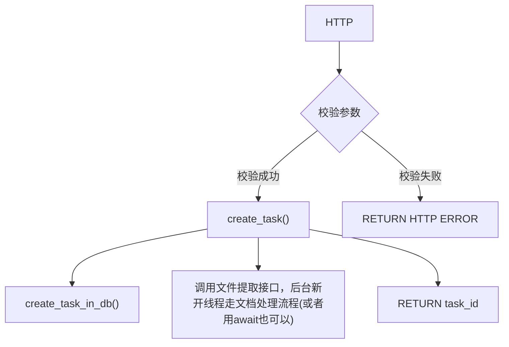
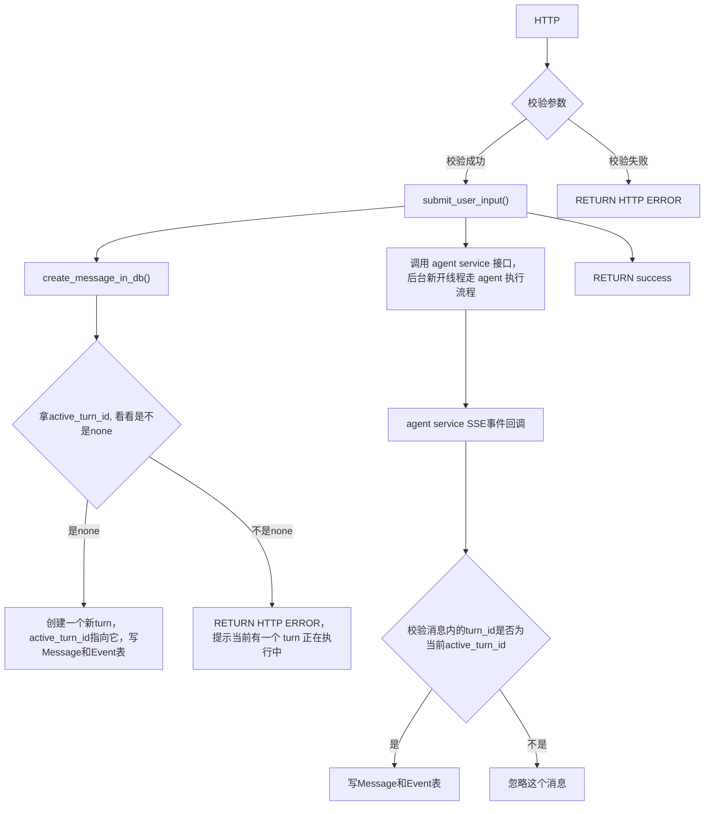
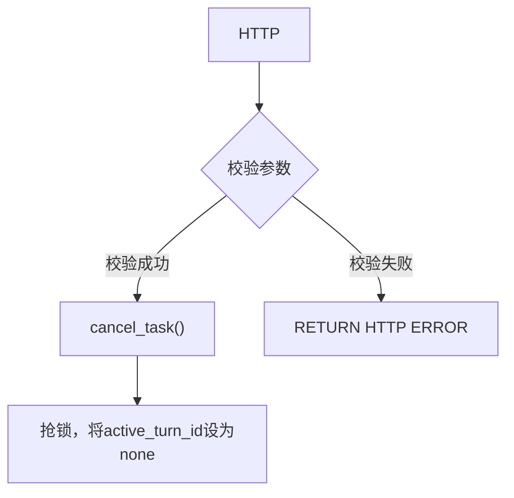
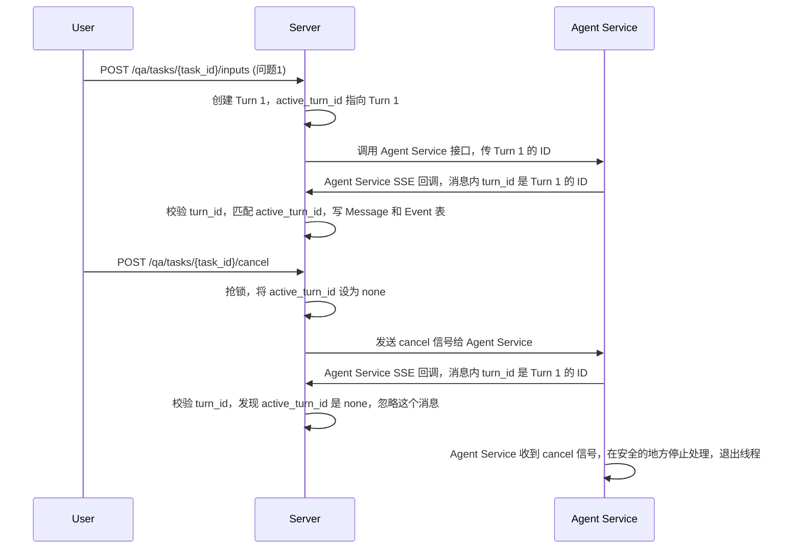
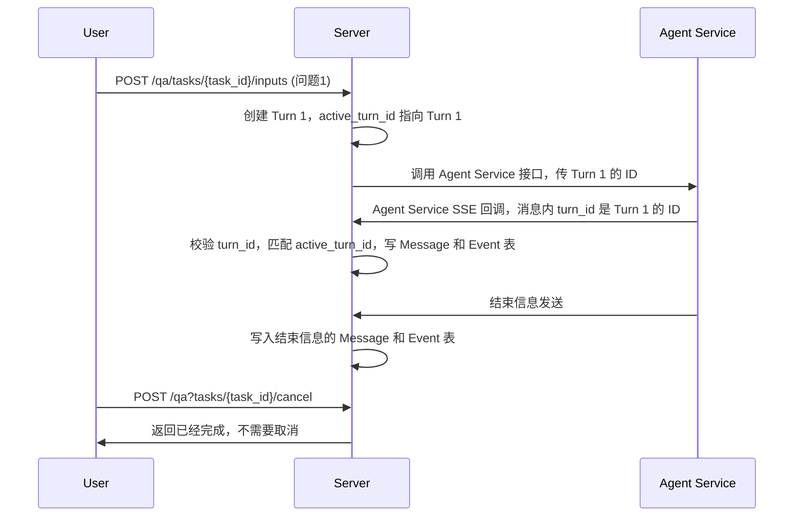

# api 流程图

## POST /qa/tasks

```mermaid
flowchart TD
    HTTP --> B{校验参数}
    B -- 校验成功 --> C["create_task()"]
    B -- 校验失败 --> D[RETURN HTTP ERROR]
    C --> E["create_task_in_db()"]
    C --> F["调用文件提取接口，后台新开线程走文档处理流程(或者用await也可以)"]
    C --> G[RETURN task_id]

```

## POST /qa/tasks/{task_id}/inputs

```mermaid
flowchart TD
    HTTP --> B{校验参数}
    B -- 校验成功 --> C["submit_user_input()"]
    B -- 校验失败 --> D[RETURN HTTP ERROR]
    C --> E["create_message_in_db()"]
    C --> F["调用 agent service 接口，后台新开线程走 agent 执行流程"]
    C --> G[RETURN success]
    E --> H{"拿active_turn_id, 看看是不是none"}
    H -- 是none --> I["创建一个新turn，active_turn_id指向它，写Message和Event表"]
    H -- 不是none --> J[RETURN HTTP ERROR，提示当前有一个 turn 正在执行中]
    F --> K["agent service SSE事件回调"]
    K --> L{"校验消息内的turn_id是否为当前active_turn_id"}
    L -- 是 --> M[写Message和Event表]
    L -- 不是 --> N[忽略这个消息]

```

## POST /qa/tasks/{task_id}/cancel

```mermaid
flowchart TD
    HTTP --> B{校验参数}
    B -- 校验成功 --> C["cancel_task()"]
    B -- 校验失败 --> D[RETURN HTTP ERROR]
    C --> E["抢锁，将active_turn_id设为none"]

```

## 可能出现的竞态情况

```mermaid
sequenceDiagram
    participant U as User
    participant S as Server
    participant A as Agent Service

    U->>S: POST /qa/tasks/{task_id}/inputs (问题1)
    S->>S: 创建 Turn 1，active_turn_id 指向 Turn 1
    S->>A: 调用 Agent Service 接口，传 Turn 1 的 ID
    A->>S: Agent Service SSE 回调，消息内 turn_id 是 Turn 1 的 ID
    S->>S: 校验 turn_id，匹配 active_turn_id，写 Message 和 Event 表

    U->>S: POST /qa/tasks/{task_id}/cancel
    S->>S: 抢锁，将 active_turn_id 设为 none
    S->>A: 发送 cancel 信号给 Agent Service

    A->>S: Agent Service SSE 回调，消息内 turn_id 是 Turn 1 的 ID
    S->>S: 校验 turn_id，发现 active_turn_id 是 none，忽略这个消息
    A->>A: Agent Service 收到 cancel 信号，在安全的地方停止处理，退出线程
```

## 可能出现的竞态情况 2

```mermaid
sequenceDiagram
    participant U as User
    participant S as Server
    participant A as Agent Service  
    U->>S: POST /qa/tasks/{task_id}/inputs (问题1)
    S->>S: 创建 Turn 1，active_turn_id 指向 Turn 1
    S->>A: 调用 Agent Service 接口，传 Turn 1 的 ID
    A->>S: Agent Service SSE 回调，消息内 turn_id 是 Turn 1 的 ID
    S->>S: 校验 turn_id，匹配 active_turn_id，写 Message 和 Event 表    
    A->> S: 结束信息发送
    S->> S: 写入结束信息的 Message 和 Event 表
    U->> S: POST /qa?tasks/{task_id}/cancel
    S->> U: 返回已经完成，不需要取消
    
```
